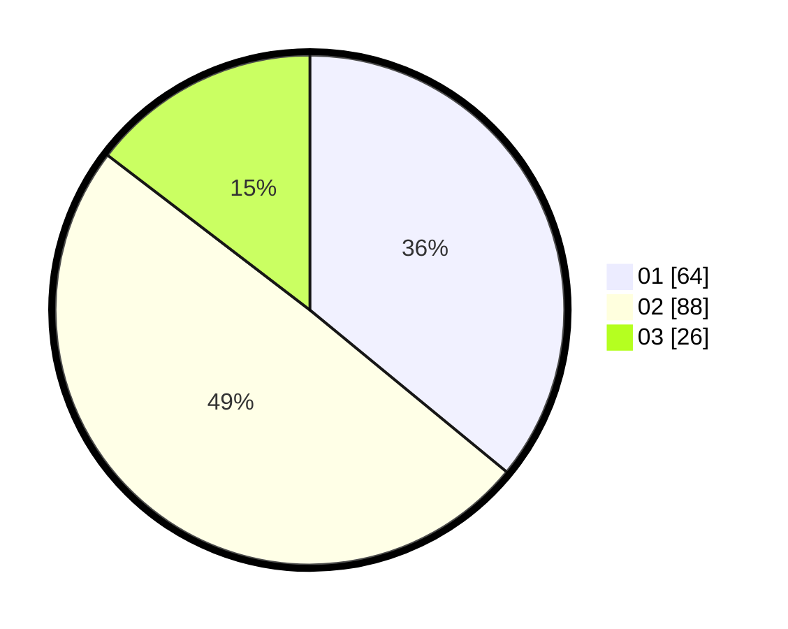

# Hasil

Hasil perolehan suara paslon dapat dilihat pada file paslon-01.txt, paslon-02.txt, dan paslon-03.txt.

Jika tidak ada, artinya data tersebut belum ada pada SIREKAP.

## Perolehan Suara

 * Paslon 01: **64**.
 * Paslon 02: **88**.
 * Paslon 03: **26**.

## Foto C Plano

https://sirekap-obj-formc.kpu.go.id/3a17/pemilu/ppwp/31/74/06/10/01/3174061001185-20240214-225746--9c4c704f-3e55-4e45-9109-4916a687e963.jpg

https://sirekap-obj-formc.kpu.go.id/3a17/pemilu/ppwp/31/74/06/10/01/3174061001185-20240214-225822--41c93b29-f027-4d24-a58a-80c71e64f88c.jpg

https://sirekap-obj-formc.kpu.go.id/3a17/pemilu/ppwp/31/74/06/10/01/3174061001185-20240214-230002--fab1ed7f-5c57-44bb-8800-10a04ca0a427.jpg
