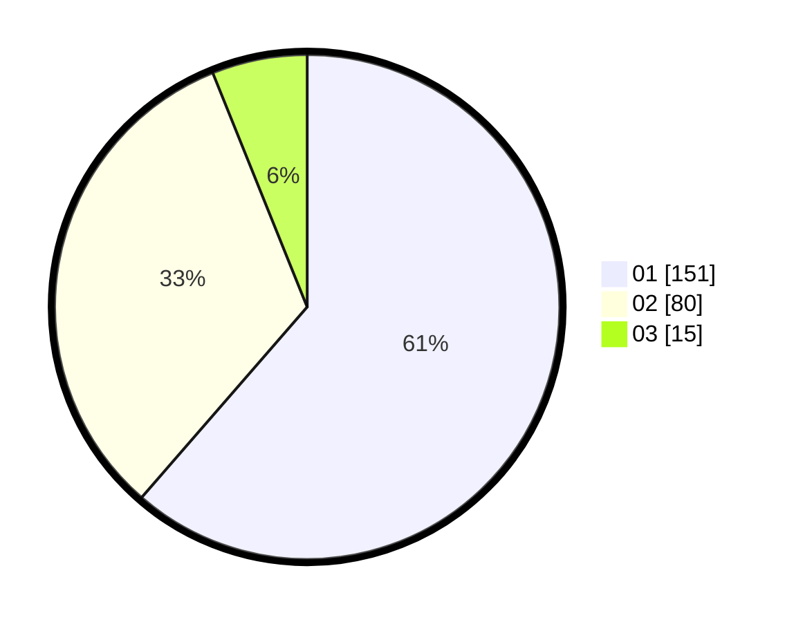

# Hasil

Hasil perolehan suara paslon dapat dilihat pada file paslon-01.txt, paslon-02.txt, dan paslon-03.txt.

Jika tidak ada, artinya data tersebut belum ada pada SIREKAP.

## Perolehan Suara

 * Paslon 01: **151**.
 * Paslon 02: **80**.
 * Paslon 03: **15**.

## Foto C Plano

https://sirekap-obj-formc.kpu.go.id/cae6/pemilu/ppwp/31/74/06/10/02/3174061002005-20240214-155628--f1f0f411-65d2-4c8a-a135-7df7b5f56f0b.jpg

https://sirekap-obj-formc.kpu.go.id/cae6/pemilu/ppwp/31/74/06/10/02/3174061002005-20240214-155421--a4c34500-e449-4642-ba08-5d2b32c9ec67.jpg

https://sirekap-obj-formc.kpu.go.id/cae6/pemilu/ppwp/31/74/06/10/02/3174061002005-20240214-155533--63bd5ed0-c785-47f4-a45b-f018a4e9a3b9.jpg

## DATA PEMILIH TETAP

Jumlah pemilih dalam DPT: **269**.
 * L: **140**.
 * P: **129**.

## DATA PENGGUNA HAK PILIH

Jumlah pengguna hak pilih dalam DPT: **220**.
 * L: **114**.
 * P: **106**.

Jumlah pengguna hak pilih dalam DPTb: **24**.
 * L: **5**.
 * P: **19**.

Jumlah pengguna hak pilih dalam DPK: **4**.
 * L: **3**.
 * P: **1**.

Jumlah pengguna hak pilih: **248**.
 * L: **122**.
 * P: **126**.

## JUMLAH SUARA SAH DAN TIDAK SAH

JUMLAH SELURUH SUARA SAH: **246**.

JUMLAH SUARA TIDAK SAH: **2**.

JUMLAH SELURUH SUARA SAH DAN SUARA TIDAK SAH: **248**.
