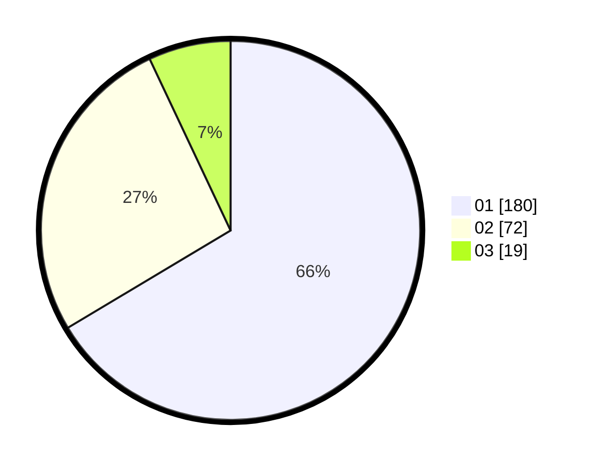

# Hasil

Hasil perolehan suara paslon dapat dilihat pada file paslon-01.txt, paslon-02.txt, dan paslon-03.txt.

Jika tidak ada, artinya data tersebut belum ada pada SIREKAP.

## Perolehan Suara

 * Paslon 01: **180**.
 * Paslon 02: **72**.
 * Paslon 03: **19**.

## Foto C Plano

https://sirekap-obj-formc.kpu.go.id/f6e1/pemilu/ppwp/31/74/06/10/02/3174061002015-20240216-203222--13f72667-69d0-4a0f-b893-74d78b2e7b8c.jpg

https://sirekap-obj-formc.kpu.go.id/f6e1/pemilu/ppwp/31/74/06/10/02/3174061002015-20240216-203652--ea1b32b0-fe7d-49d4-8665-5c9a9b343b3b.jpg

https://sirekap-obj-formc.kpu.go.id/f6e1/pemilu/ppwp/31/74/06/10/02/3174061002015-20240216-203545--5f197da4-400c-4afe-9ca0-19f7800c216e.jpg

## DATA PEMILIH TETAP

Jumlah pemilih dalam DPT: **299**.
 * L: **145**.
 * P: **154**.

## DATA PENGGUNA HAK PILIH

Jumlah pengguna hak pilih dalam DPT: **260**.
 * L: **120**.
 * P: **140**.

Jumlah pengguna hak pilih dalam DPTb: **14**.
 * L: **4**.
 * P: **13**.

Jumlah pengguna hak pilih dalam DPK: **41**.
 * L: **1**.
 * P: **0**.

Jumlah pengguna hak pilih: **275**.
 * L: **121**.
 * P: **153**.

## JUMLAH SUARA SAH DAN TIDAK SAH

JUMLAH SELURUH SUARA SAH: **271**.

JUMLAH SUARA TIDAK SAH: **4**.

JUMLAH SELURUH SUARA SAH DAN SUARA TIDAK SAH: **275**.
