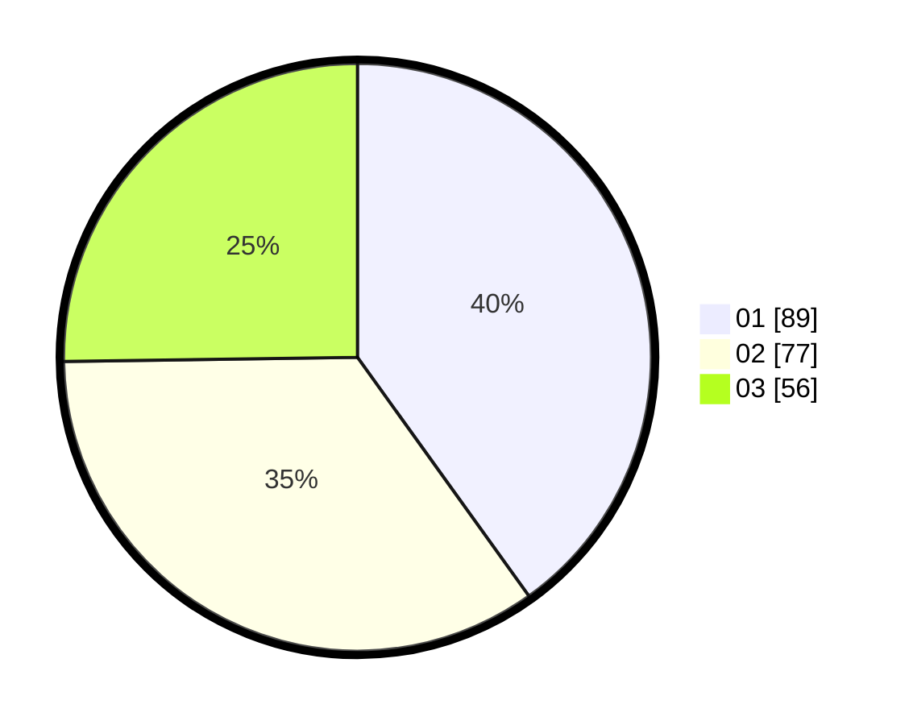

# Hasil

Hasil perolehan suara paslon dapat dilihat pada file paslon-01.txt, paslon-02.txt, dan paslon-03.txt.

Jika tidak ada, artinya data tersebut belum ada pada SIREKAP.

## Perolehan Suara

 * Paslon 01: **89**.
 * Paslon 02: **77**.
 * Paslon 03: **56**.

## Foto C Plano

https://sirekap-obj-formc.kpu.go.id/2e3d/pemilu/ppwp/31/74/06/10/02/3174061002020-20240214-194131--c6e292fe-b8aa-4a2e-87dc-2c6cfdbf07f8.jpg

https://sirekap-obj-formc.kpu.go.id/2e3d/pemilu/ppwp/31/74/06/10/02/3174061002020-20240214-203338--bcbaa385-6328-4e3b-a1b0-a714b2533dd0.jpg

https://sirekap-obj-formc.kpu.go.id/2e3d/pemilu/ppwp/31/74/06/10/02/3174061002020-20240214-193329--25378544-af38-4080-b720-2c481064487c.jpg

## DATA PEMILIH TETAP

Jumlah pemilih dalam DPT: **292**.
 * L: **138**.
 * P: **154**.

## DATA PENGGUNA HAK PILIH

Jumlah pengguna hak pilih dalam DPT: **222**.
 * L: **101**.
 * P: **121**.

Jumlah pengguna hak pilih dalam DPTb: **0**.
 * L: **0**.
 * P: **0**.

Jumlah pengguna hak pilih dalam DPK: **1**.
 * L: **0**.
 * P: **1**.

Jumlah pengguna hak pilih: **223**.
 * L: **101**.
 * P: **122**.

## JUMLAH SUARA SAH DAN TIDAK SAH

JUMLAH SELURUH SUARA SAH: **222**.

JUMLAH SUARA TIDAK SAH: **1**.

JUMLAH SELURUH SUARA SAH DAN SUARA TIDAK SAH: **223**.
