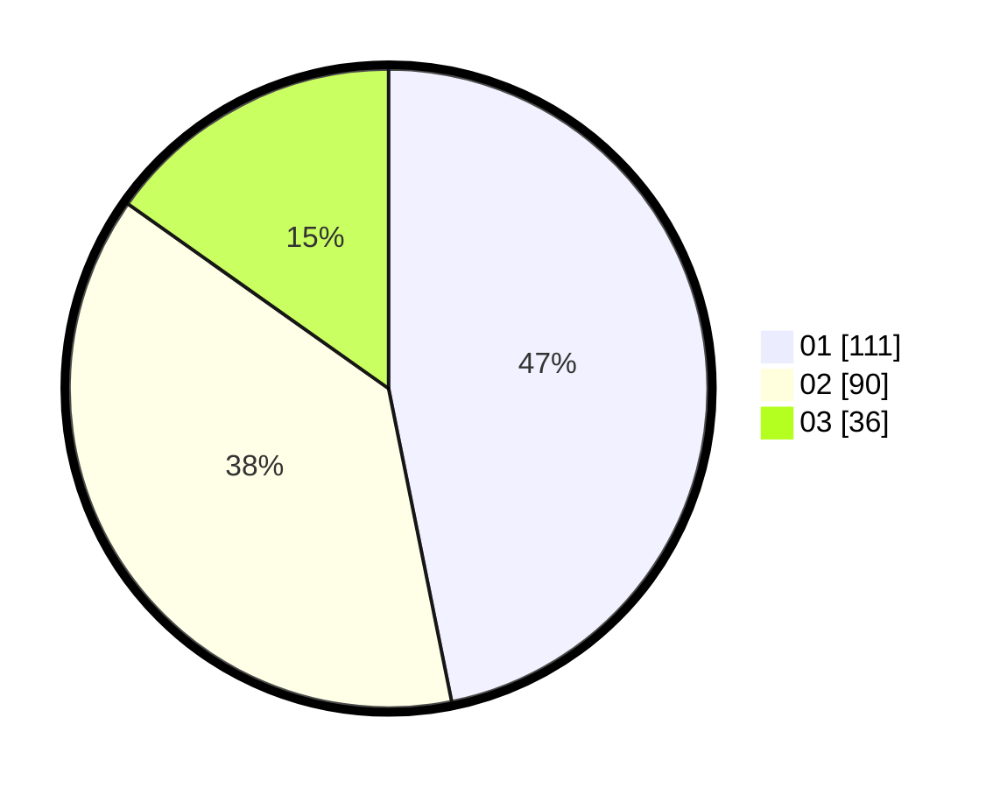

# Hasil

Hasil perolehan suara paslon dapat dilihat pada file paslon-01.txt, paslon-02.txt, dan paslon-03.txt.

Jika tidak ada, artinya data tersebut belum ada pada SIREKAP.

## Perolehan Suara

 * Paslon 01: **111**.
 * Paslon 02: **90**.
 * Paslon 03: **36**.

## Foto C Plano

https://sirekap-obj-formc.kpu.go.id/e10f/pemilu/ppwp/31/74/06/10/02/3174061002029-20240217-103519--13639ec9-c6dd-49ec-9c99-0ec895d1a026.jpg

https://sirekap-obj-formc.kpu.go.id/e10f/pemilu/ppwp/31/74/06/10/02/3174061002029-20240217-103603--9fa0d851-86ef-4850-8bad-d2e80ca7682b.jpg

https://sirekap-obj-formc.kpu.go.id/e10f/pemilu/ppwp/31/74/06/10/02/3174061002029-20240217-103654--723e1770-75c9-4b89-8a99-ca661f3f7c36.jpg

## DATA PEMILIH TETAP

Jumlah pemilih dalam DPT: **300**.
 * L: **139**.
 * P: **161**.

## DATA PENGGUNA HAK PILIH

Jumlah pengguna hak pilih dalam DPT: **232**.
 * L: **104**.
 * P: **728**.

Jumlah pengguna hak pilih dalam DPTb: **4**.
 * L: **1**.
 * P: **3**.

Jumlah pengguna hak pilih dalam DPK: **4**.
 * L: **2**.
 * P: **2**.

Jumlah pengguna hak pilih: **240**.
 * L: **109**.
 * P: **131**.

## JUMLAH SUARA SAH DAN TIDAK SAH

JUMLAH SELURUH SUARA SAH: **237**.

JUMLAH SUARA TIDAK SAH: **3**.

JUMLAH SELURUH SUARA SAH DAN SUARA TIDAK SAH: **240**.
