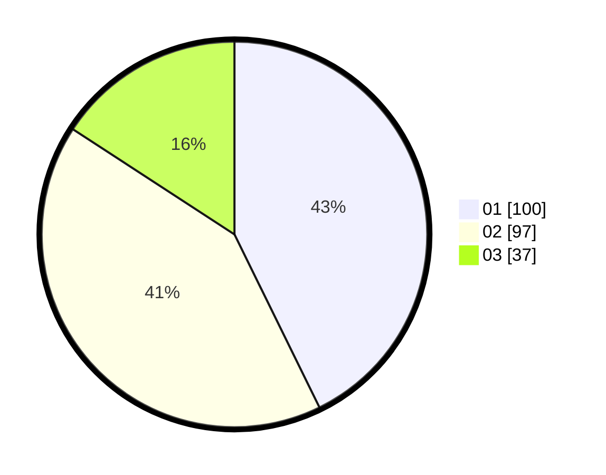

# Hasil

Hasil perolehan suara paslon dapat dilihat pada file paslon-01.txt, paslon-02.txt, dan paslon-03.txt.

Jika tidak ada, artinya data tersebut belum ada pada SIREKAP.

## Perolehan Suara

 * Paslon 01: **100**.
 * Paslon 02: **97**.
 * Paslon 03: **37**.

## Foto C Plano

https://sirekap-obj-formc.kpu.go.id/0934/pemilu/ppwp/31/74/06/10/02/3174061002033-20240214-190943--ca0508d5-d818-4f95-b2ef-64dfddf43aa6.jpg

https://sirekap-obj-formc.kpu.go.id/0934/pemilu/ppwp/31/74/06/10/02/3174061002033-20240214-191028--a53f011b-34e3-4bf0-b1a3-03c300a1c7f1.jpg

https://sirekap-obj-formc.kpu.go.id/0934/pemilu/ppwp/31/74/06/10/02/3174061002033-20240214-191100--f330a625-2af2-4df4-a3d7-46956bb6837a.jpg

## DATA PEMILIH TETAP

Jumlah pemilih dalam DPT: **327**.
 * L: **177**.
 * P: **150**.

## DATA PENGGUNA HAK PILIH

Jumlah pengguna hak pilih dalam DPT: **280**.
 * L: **108**.
 * P: **172**.

Jumlah pengguna hak pilih dalam DPTb: **2**.
 * L: **0**.
 * P: **2**.

Jumlah pengguna hak pilih dalam DPK: **2**.
 * L: **2**.
 * P: **0**.

Jumlah pengguna hak pilih: **244**.
 * L: **110**.
 * P: **134**.

## JUMLAH SUARA SAH DAN TIDAK SAH

JUMLAH SELURUH SUARA SAH: **234**.

JUMLAH SUARA TIDAK SAH: **10**.

JUMLAH SELURUH SUARA SAH DAN SUARA TIDAK SAH: **244**.
