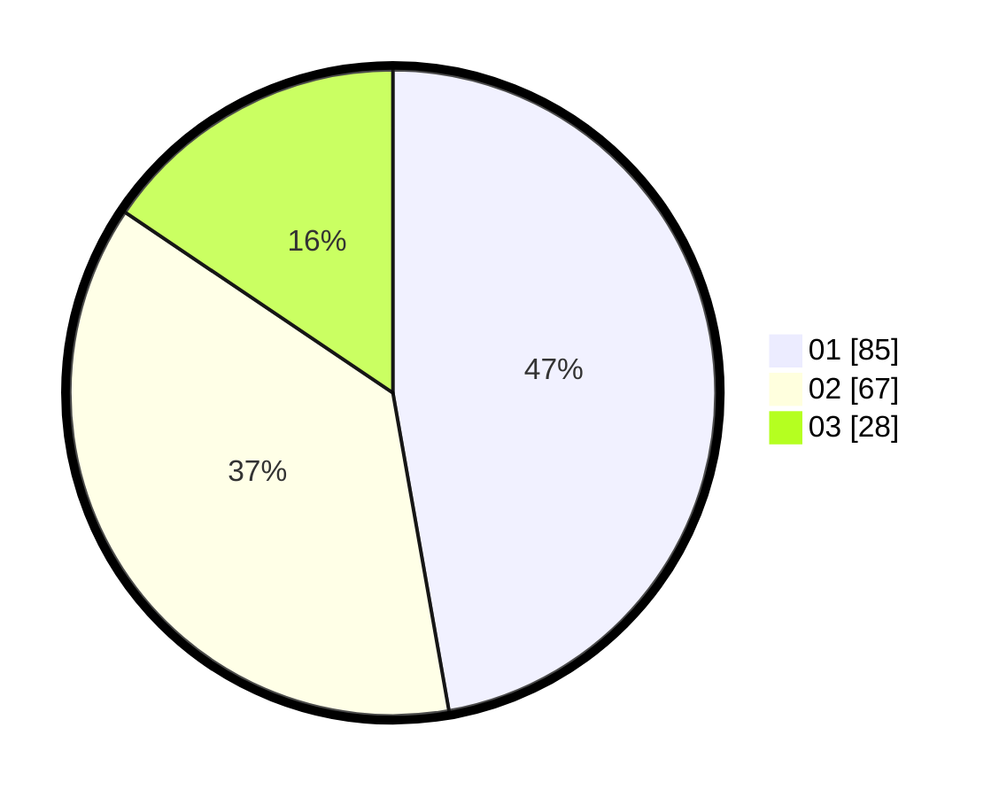

# Hasil

Hasil perolehan suara paslon dapat dilihat pada file paslon-01.txt, paslon-02.txt, dan paslon-03.txt.

Jika tidak ada, artinya data tersebut belum ada pada SIREKAP.

## Perolehan Suara

 * Paslon 01: **85**.
 * Paslon 02: **67**.
 * Paslon 03: **28**.

## Foto C Plano

https://sirekap-obj-formc.kpu.go.id/1aae/pemilu/ppwp/31/74/06/10/02/3174061002034-20240217-103855--f6ced87f-2ab0-49b3-bb0b-8b84b8e59054.jpg

https://sirekap-obj-formc.kpu.go.id/1aae/pemilu/ppwp/31/74/06/10/02/3174061002034-20240217-103958--bb0dcc9f-626f-4c47-8652-82adb3b41633.jpg

https://sirekap-obj-formc.kpu.go.id/1aae/pemilu/ppwp/31/74/06/10/02/3174061002034-20240217-104055--e9821256-c19a-4bd3-be63-93bbac3dea48.jpg

## DATA PEMILIH TETAP

Jumlah pemilih dalam DPT: **218**.
 * L: **104**.
 * P: **114**.

## DATA PENGGUNA HAK PILIH

Jumlah pengguna hak pilih dalam DPT: **180**.
 * L: **86**.
 * P: **94**.

Jumlah pengguna hak pilih dalam DPTb: **0**.
 * L: **0**.
 * P: **0**.

Jumlah pengguna hak pilih dalam DPK: **0**.
 * L: **0**.
 * P: **0**.

Jumlah pengguna hak pilih: **180**.
 * L: **85**.
 * P: **94**.

## JUMLAH SUARA SAH DAN TIDAK SAH

JUMLAH SELURUH SUARA SAH: **180**.

JUMLAH SUARA TIDAK SAH: **0**.

JUMLAH SELURUH SUARA SAH DAN SUARA TIDAK SAH: **180**.
