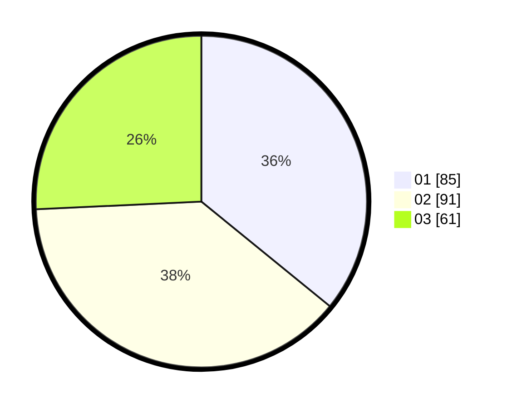

# Hasil

Hasil perolehan suara paslon dapat dilihat pada file paslon-01.txt, paslon-02.txt, dan paslon-03.txt.

Jika tidak ada, artinya data tersebut belum ada pada SIREKAP.

## Perolehan Suara

 * Paslon 01: **85**.
 * Paslon 02: **91**.
 * Paslon 03: **61**.

## Foto C Plano

https://sirekap-obj-formc.kpu.go.id/5076/pemilu/ppwp/31/74/06/10/02/3174061002046-20240214-230253--2b21f792-b193-4a64-84d4-74a530c41ab2.jpg

https://sirekap-obj-formc.kpu.go.id/5076/pemilu/ppwp/31/74/06/10/02/3174061002046-20240214-230050--0f46232c-5389-44af-8a94-c24a5cb58c51.jpg

https://sirekap-obj-formc.kpu.go.id/5076/pemilu/ppwp/31/74/06/10/02/3174061002046-20240214-230206--a710ec8e-7e66-4ac8-92e8-e136223fa7b7.jpg

## DATA PEMILIH TETAP

Jumlah pemilih dalam DPT: **292**.
 * L: **140**.
 * P: **152**.

## DATA PENGGUNA HAK PILIH

Jumlah pengguna hak pilih dalam DPT: **234**.
 * L: **113**.
 * P: **121**.

Jumlah pengguna hak pilih dalam DPTb: **3**.
 * L: **3**.
 * P: **0**.

Jumlah pengguna hak pilih dalam DPK: **3**.
 * L: **0**.
 * P: **3**.

Jumlah pengguna hak pilih: **240**.
 * L: **116**.
 * P: **124**.

## JUMLAH SUARA SAH DAN TIDAK SAH

JUMLAH SELURUH SUARA SAH: **237**.

JUMLAH SUARA TIDAK SAH: **3**.

JUMLAH SELURUH SUARA SAH DAN SUARA TIDAK SAH: **240**.
