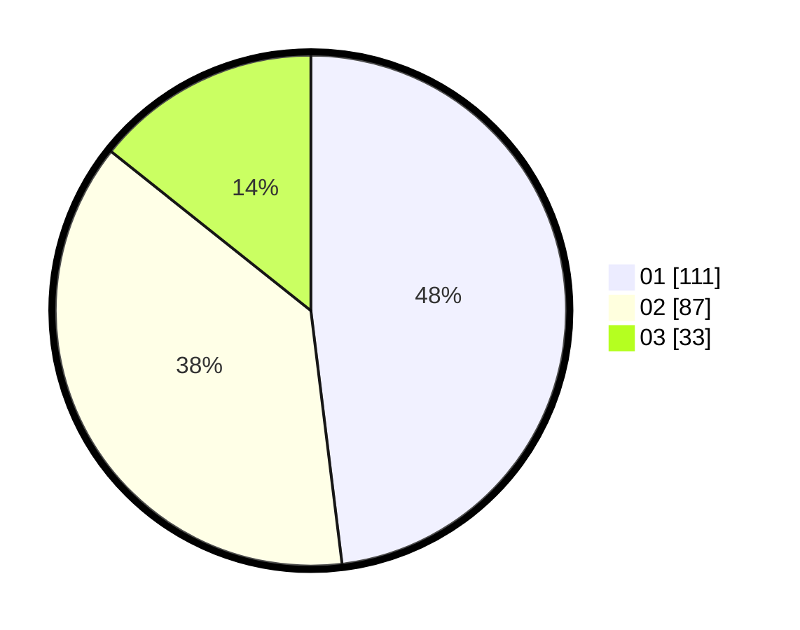

# Hasil

Hasil perolehan suara paslon dapat dilihat pada file paslon-01.txt, paslon-02.txt, dan paslon-03.txt.

Jika tidak ada, artinya data tersebut belum ada pada SIREKAP.

## Perolehan Suara

 * Paslon 01: **111**.
 * Paslon 02: **87**.
 * Paslon 03: **33**.

## Foto C Plano

https://sirekap-obj-formc.kpu.go.id/43b0/pemilu/ppwp/31/74/06/10/02/3174061002050-20240217-112515--b19a6aeb-233e-4f57-9c5e-1bda0c2b4473.jpg

https://sirekap-obj-formc.kpu.go.id/43b0/pemilu/ppwp/31/74/06/10/02/3174061002050-20240217-112408--5635cd34-f740-4de8-9af5-1d3c78a29a9e.jpg

https://sirekap-obj-formc.kpu.go.id/43b0/pemilu/ppwp/31/74/06/10/02/3174061002050-20240217-112618--a705d955-70fa-49a0-b51b-bb18ad3b06a7.jpg

## DATA PEMILIH TETAP

Jumlah pemilih dalam DPT: **300**.
 * L: **154**.
 * P: **146**.

## DATA PENGGUNA HAK PILIH

Jumlah pengguna hak pilih dalam DPT: **231**.
 * L: **111**.
 * P: **120**.

Jumlah pengguna hak pilih dalam DPTb: **6**.
 * L: **3**.
 * P: **3**.

Jumlah pengguna hak pilih dalam DPK: **2**.
 * L: **1**.
 * P: **1**.

Jumlah pengguna hak pilih: **239**.
 * L: **115**.
 * P: **129**.

## JUMLAH SUARA SAH DAN TIDAK SAH

JUMLAH SELURUH SUARA SAH: **231**.

JUMLAH SUARA TIDAK SAH: **0**.

JUMLAH SELURUH SUARA SAH DAN SUARA TIDAK SAH: **231**.
