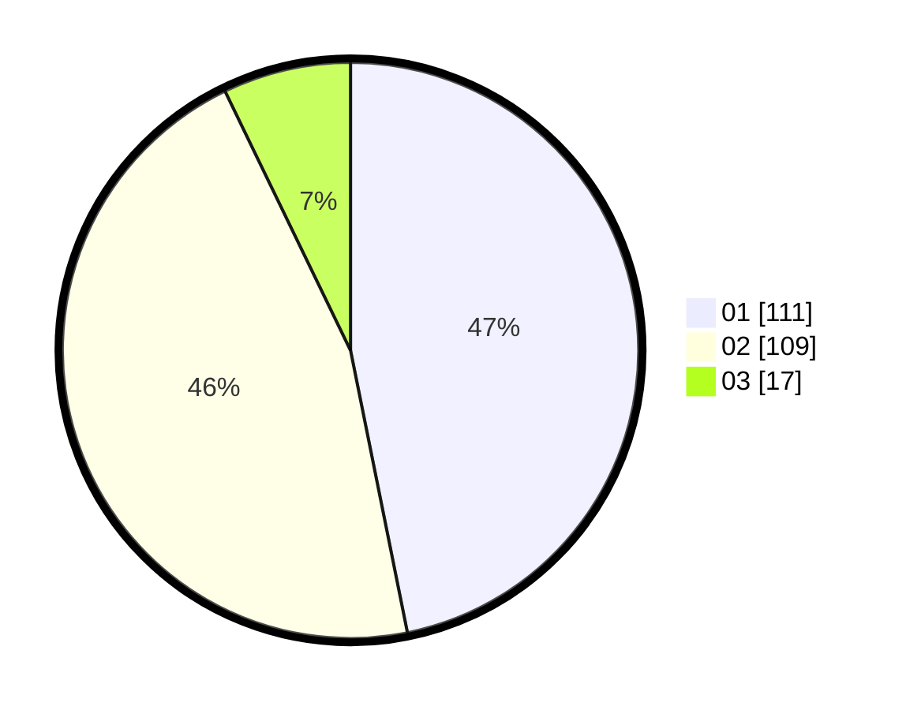

# Hasil

Hasil perolehan suara paslon dapat dilihat pada file paslon-01.txt, paslon-02.txt, dan paslon-03.txt.

Jika tidak ada, artinya data tersebut belum ada pada SIREKAP.

## Perolehan Suara

 * Paslon 01: **111**.
 * Paslon 02: **109**.
 * Paslon 03: **17**.

## Foto C Plano

https://sirekap-obj-formc.kpu.go.id/6c97/pemilu/ppwp/31/74/06/10/02/3174061002051-20240217-112813--f7a6adc8-66e9-4cf1-b5b9-b621ce0e7536.jpg

https://sirekap-obj-formc.kpu.go.id/6c97/pemilu/ppwp/31/74/06/10/02/3174061002051-20240217-112910--9b11a294-41d2-4e44-bea0-6d8055b18490.jpg

https://sirekap-obj-formc.kpu.go.id/6c97/pemilu/ppwp/31/74/06/10/02/3174061002051-20240217-113050--ac8bd057-cbd2-4cdd-a046-1fd2352a548e.jpg

## DATA PEMILIH TETAP

Jumlah pemilih dalam DPT: **233**.
 * L: **103**.
 * P: **128**.

## DATA PENGGUNA HAK PILIH

Jumlah pengguna hak pilih dalam DPT: **231**.
 * L: **103**.
 * P: **128**.

Jumlah pengguna hak pilih dalam DPTb: **9**.
 * L: **5**.
 * P: **4**.

Jumlah pengguna hak pilih dalam DPK: **0**.
 * L: **0**.
 * P: **0**.

Jumlah pengguna hak pilih: **240**.
 * L: **108**.
 * P: **132**.

## JUMLAH SUARA SAH DAN TIDAK SAH

JUMLAH SELURUH SUARA SAH: **237**.

JUMLAH SUARA TIDAK SAH: **3**.

JUMLAH SELURUH SUARA SAH DAN SUARA TIDAK SAH: **240**.
