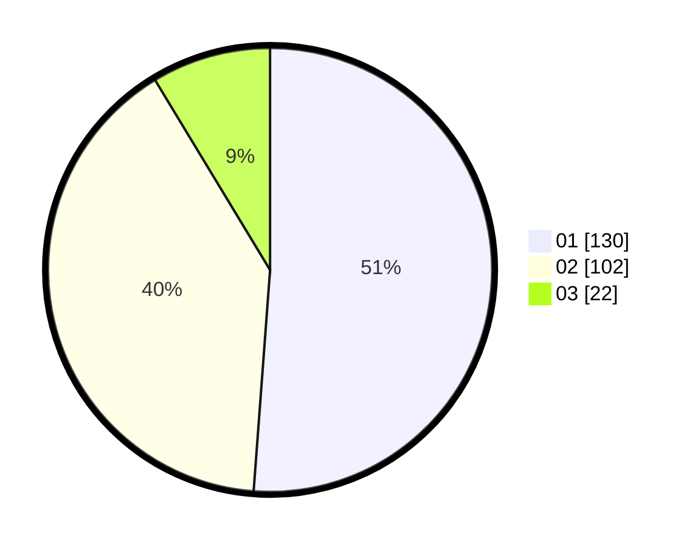

# Hasil

Hasil perolehan suara paslon dapat dilihat pada file paslon-01.txt, paslon-02.txt, dan paslon-03.txt.

Jika tidak ada, artinya data tersebut belum ada pada SIREKAP.

## Perolehan Suara

 * Paslon 01: **130**.
 * Paslon 02: **102**.
 * Paslon 03: **22**.

## Foto C Plano

https://sirekap-obj-formc.kpu.go.id/dcc0/pemilu/ppwp/31/74/06/10/02/3174061002056-20240217-120359--8bb20a13-8dc6-4d5b-8114-27d5e106a684.jpg

https://sirekap-obj-formc.kpu.go.id/dcc0/pemilu/ppwp/31/74/06/10/02/3174061002056-20240217-120538--8960aecd-3f2d-4321-932e-1a045466ddc4.jpg

https://sirekap-obj-formc.kpu.go.id/dcc0/pemilu/ppwp/31/74/06/10/02/3174061002056-20240217-120643--f568be61-25d7-4b98-9b57-eff8805db0b6.jpg

## DATA PEMILIH TETAP

Jumlah pemilih dalam DPT: **299**.
 * L: **157**.
 * P: **142**.

## DATA PENGGUNA HAK PILIH

Jumlah pengguna hak pilih dalam DPT: **236**.
 * L: **121**.
 * P: **185**.

Jumlah pengguna hak pilih dalam DPTb: **2**.
 * L: **100**.
 * P: **100**.

Jumlah pengguna hak pilih dalam DPK: **20**.
 * L: **700**.
 * P: **130**.

Jumlah pengguna hak pilih: **258**.
 * L: **129**.
 * P: **121**.

## JUMLAH SUARA SAH DAN TIDAK SAH

JUMLAH SELURUH SUARA SAH: **254**.

JUMLAH SUARA TIDAK SAH: **3**.

JUMLAH SELURUH SUARA SAH DAN SUARA TIDAK SAH: **257**.
