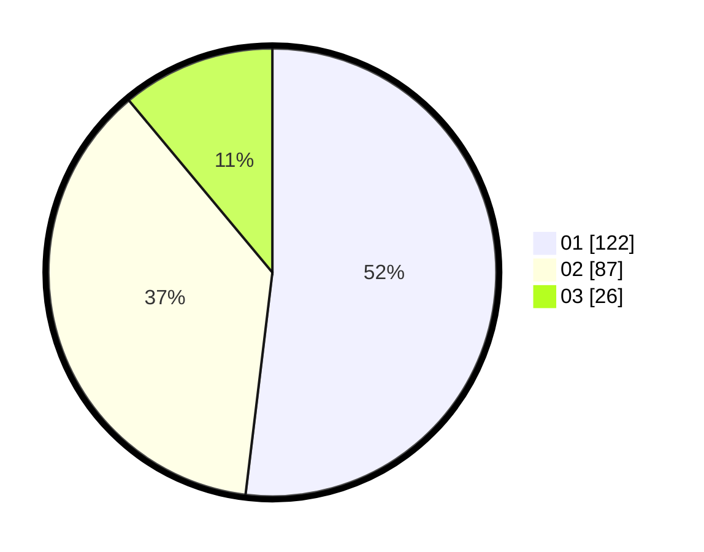

# Hasil

Hasil perolehan suara paslon dapat dilihat pada file paslon-01.txt, paslon-02.txt, dan paslon-03.txt.

Jika tidak ada, artinya data tersebut belum ada pada SIREKAP.

## Perolehan Suara

 * Paslon 01: **122**.
 * Paslon 02: **87**.
 * Paslon 03: **26**.

## Foto C Plano

https://sirekap-obj-formc.kpu.go.id/ceb4/pemilu/ppwp/31/74/06/10/02/3174061002060-20240217-140313--4d92e5ac-0835-45af-897a-981966410721.jpg

https://sirekap-obj-formc.kpu.go.id/ceb4/pemilu/ppwp/31/74/06/10/02/3174061002060-20240214-213928--13408c56-701c-45e8-8ae2-4378ad8e51b9.jpg

https://sirekap-obj-formc.kpu.go.id/ceb4/pemilu/ppwp/31/74/06/10/02/3174061002060-20240214-214341--b1c6af94-51f8-445c-a27b-77a6f140816c.jpg

## DATA PEMILIH TETAP

Jumlah pemilih dalam DPT: **244**.
 * L: **143**.
 * P: **155**.

## DATA PENGGUNA HAK PILIH

Jumlah pengguna hak pilih dalam DPT: **228**.
 * L: **107**.
 * P: **121**.

Jumlah pengguna hak pilih dalam DPTb: **4**.
 * L: **5**.
 * P: **3**.

Jumlah pengguna hak pilih dalam DPK: **0**.
 * L: **0**.
 * P: **0**.

Jumlah pengguna hak pilih: **236**.
 * L: **112**.
 * P: **124**.

## JUMLAH SUARA SAH DAN TIDAK SAH

JUMLAH SELURUH SUARA SAH: **235**.

JUMLAH SUARA TIDAK SAH: **1**.

JUMLAH SELURUH SUARA SAH DAN SUARA TIDAK SAH: **236**.
