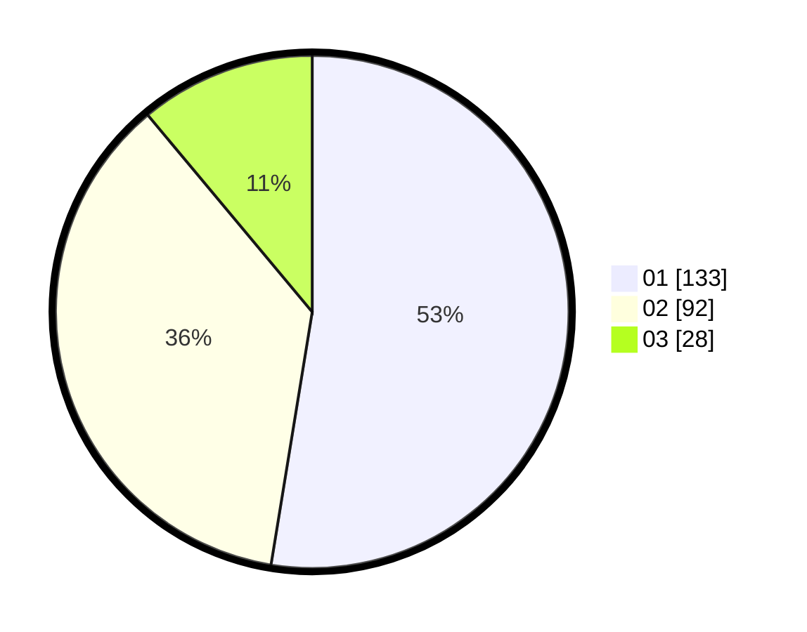

# Hasil

Hasil perolehan suara paslon dapat dilihat pada file paslon-01.txt, paslon-02.txt, dan paslon-03.txt.

Jika tidak ada, artinya data tersebut belum ada pada SIREKAP.

## Perolehan Suara

 * Paslon 01: **133**.
 * Paslon 02: **92**.
 * Paslon 03: **28**.

## Foto C Plano

https://sirekap-obj-formc.kpu.go.id/e863/pemilu/ppwp/31/74/06/10/02/3174061002062-20240215-225507--b7c787ac-61ec-4643-aa9e-fe021cdd35ac.jpg

https://sirekap-obj-formc.kpu.go.id/e863/pemilu/ppwp/31/74/06/10/02/3174061002062-20240214-184522--5d9a3dbb-787b-4c49-9e7f-bd2d1f585651.jpg

https://sirekap-obj-formc.kpu.go.id/e863/pemilu/ppwp/31/74/06/10/02/3174061002062-20240214-184512--f84914af-f0ca-407b-b398-f084e2f54ff0.jpg

## DATA PEMILIH TETAP

Jumlah pemilih dalam DPT: **295**.
 * L: **156**.
 * P: **139**.

## DATA PENGGUNA HAK PILIH

Jumlah pengguna hak pilih dalam DPT: **249**.
 * L: **127**.
 * P: **122**.

Jumlah pengguna hak pilih dalam DPTb: **5**.
 * L: **1**.
 * P: **4**.

Jumlah pengguna hak pilih dalam DPK: **0**.
 * L: **0**.
 * P: **0**.

Jumlah pengguna hak pilih: **254**.
 * L: **128**.
 * P: **126**.

## JUMLAH SUARA SAH DAN TIDAK SAH

JUMLAH SELURUH SUARA SAH: **253**.

JUMLAH SUARA TIDAK SAH: **1**.

JUMLAH SELURUH SUARA SAH DAN SUARA TIDAK SAH: **254**.
