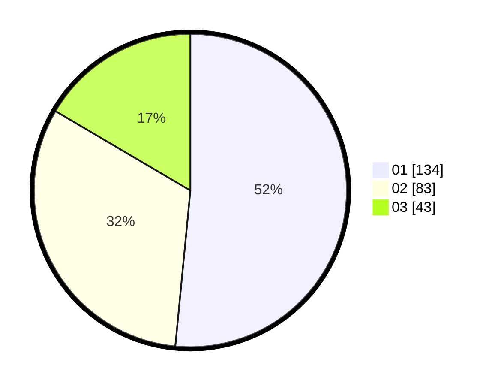

# Hasil

Hasil perolehan suara paslon dapat dilihat pada file paslon-01.txt, paslon-02.txt, dan paslon-03.txt.

Jika tidak ada, artinya data tersebut belum ada pada SIREKAP.

## Perolehan Suara

 * Paslon 01: **134**.
 * Paslon 02: **83**.
 * Paslon 03: **43**.

## Foto C Plano

https://sirekap-obj-formc.kpu.go.id/93b9/pemilu/ppwp/31/74/06/10/02/3174061002063-20240214-155418--b90311b2-8f04-4e94-b4e9-5351ebcc29e7.jpg

https://sirekap-obj-formc.kpu.go.id/93b9/pemilu/ppwp/31/74/06/10/02/3174061002063-20240214-155625--f24881da-27a2-4b37-857a-b13c52597083.jpg

https://sirekap-obj-formc.kpu.go.id/93b9/pemilu/ppwp/31/74/06/10/02/3174061002063-20240214-155912--5626f07e-e846-4b11-ba35-05e094b9504f.jpg

## DATA PEMILIH TETAP

Jumlah pemilih dalam DPT: **296**.
 * L: **138**.
 * P: **158**.

## DATA PENGGUNA HAK PILIH

Jumlah pengguna hak pilih dalam DPT: **242**.
 * L: **109**.
 * P: **133**.

Jumlah pengguna hak pilih dalam DPTb: **16**.
 * L: **5**.
 * P: **11**.

Jumlah pengguna hak pilih dalam DPK: **3**.
 * L: **0**.
 * P: **3**.

Jumlah pengguna hak pilih: **261**.
 * L: **114**.
 * P: **147**.

## JUMLAH SUARA SAH DAN TIDAK SAH

JUMLAH SELURUH SUARA SAH: **260**.

JUMLAH SUARA TIDAK SAH: **1**.

JUMLAH SELURUH SUARA SAH DAN SUARA TIDAK SAH: **261**.
