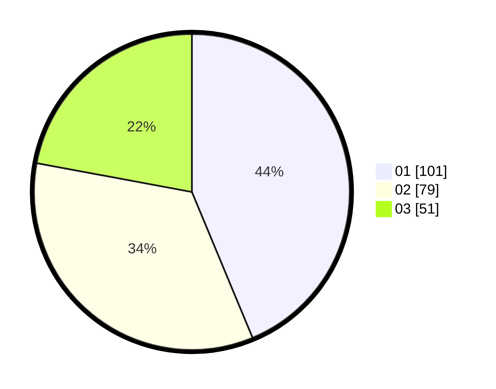

# Hasil

Hasil perolehan suara paslon dapat dilihat pada file paslon-01.txt, paslon-02.txt, dan paslon-03.txt.

Jika tidak ada, artinya data tersebut belum ada pada SIREKAP.

## Perolehan Suara

 * Paslon 01: **101**.
 * Paslon 02: **79**.
 * Paslon 03: **51**.

## Foto C Plano

https://sirekap-obj-formc.kpu.go.id/1918/pemilu/ppwp/31/74/06/10/02/3174061002065-20240214-155032--8d9d539f-1d31-4e90-a55a-5747f7b357af.jpg

https://sirekap-obj-formc.kpu.go.id/1918/pemilu/ppwp/31/74/06/10/02/3174061002065-20240214-185050--c5ea8ed2-e1c8-469a-9ed2-044760ecce28.jpg

https://sirekap-obj-formc.kpu.go.id/1918/pemilu/ppwp/31/74/06/10/02/3174061002065-20240214-155323--754d0ba5-d37e-4480-a980-16d2ff402e69.jpg

## DATA PEMILIH TETAP

Jumlah pemilih dalam DPT: **300**.
 * L: **143**.
 * P: **157**.

## DATA PENGGUNA HAK PILIH

Jumlah pengguna hak pilih dalam DPT: **233**.
 * L: **101**.
 * P: **132**.

Jumlah pengguna hak pilih dalam DPTb: **3**.
 * L: **1**.
 * P: **2**.

Jumlah pengguna hak pilih dalam DPK: **1**.
 * L: **0**.
 * P: **1**.

Jumlah pengguna hak pilih: **237**.
 * L: **102**.
 * P: **135**.

## JUMLAH SUARA SAH DAN TIDAK SAH

JUMLAH SELURUH SUARA SAH: **231**.

JUMLAH SUARA TIDAK SAH: **6**.

JUMLAH SELURUH SUARA SAH DAN SUARA TIDAK SAH: **237**.
