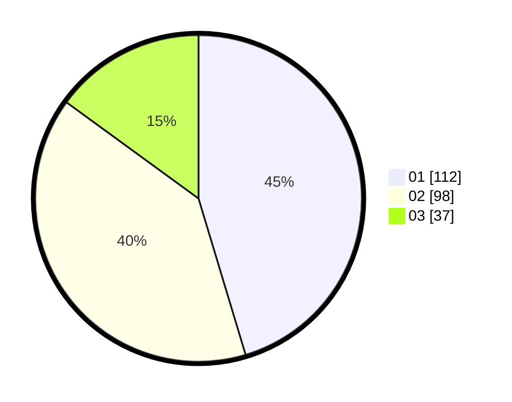

# Hasil

Hasil perolehan suara paslon dapat dilihat pada file paslon-01.txt, paslon-02.txt, dan paslon-03.txt.

Jika tidak ada, artinya data tersebut belum ada pada SIREKAP.

## Perolehan Suara

 * Paslon 01: **112**.
 * Paslon 02: **98**.
 * Paslon 03: **37**.

## Foto C Plano

https://sirekap-obj-formc.kpu.go.id/395c/pemilu/ppwp/31/74/06/10/02/3174061002073-20240214-184625--cca55c75-eb30-4b02-a59f-b8b3e68b26d5.jpg

https://sirekap-obj-formc.kpu.go.id/395c/pemilu/ppwp/31/74/06/10/02/3174061002073-20240214-184631--7211ed3a-431f-41b8-889f-e85fa963dd74.jpg

https://sirekap-obj-formc.kpu.go.id/395c/pemilu/ppwp/31/74/06/10/02/3174061002073-20240214-184638--dca53b02-f790-41ff-8074-bdd23a75285f.jpg

## DATA PEMILIH TETAP

Jumlah pemilih dalam DPT: **297**.
 * L: **149**.
 * P: **148**.

## DATA PENGGUNA HAK PILIH

Jumlah pengguna hak pilih dalam DPT: **239**.
 * L: **113**.
 * P: **126**.

Jumlah pengguna hak pilih dalam DPTb: **2**.
 * L: **1**.
 * P: **1**.

Jumlah pengguna hak pilih dalam DPK: **7**.
 * L: **2**.
 * P: **5**.

Jumlah pengguna hak pilih: **248**.
 * L: **116**.
 * P: **132**.

## JUMLAH SUARA SAH DAN TIDAK SAH

JUMLAH SELURUH SUARA SAH: **247**.

JUMLAH SUARA TIDAK SAH: **1**.

JUMLAH SELURUH SUARA SAH DAN SUARA TIDAK SAH: **248**.
