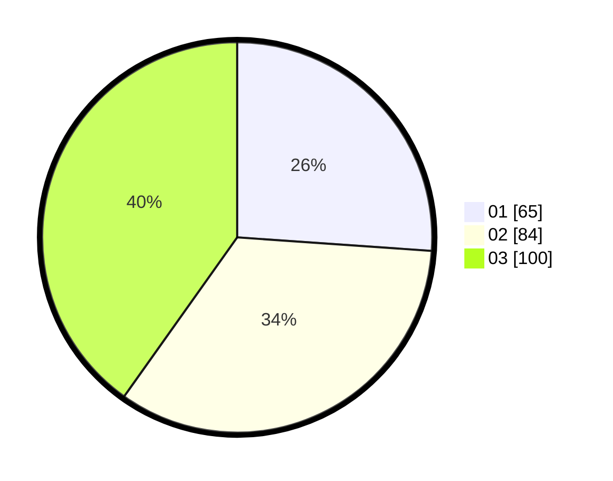

# Hasil

Hasil perolehan suara paslon dapat dilihat pada file paslon-01.txt, paslon-02.txt, dan paslon-03.txt.

Jika tidak ada, artinya data tersebut belum ada pada SIREKAP.

## Perolehan Suara

 * Paslon 01: **65**.
 * Paslon 02: **84**.
 * Paslon 03: **100**.

## Foto C Plano

https://sirekap-obj-formc.kpu.go.id/b729/pemilu/ppwp/31/74/06/10/02/3174061002075-20240218-163908--fec3b275-da6e-4983-aeb6-fa23273acc64.jpg

https://sirekap-obj-formc.kpu.go.id/b729/pemilu/ppwp/31/74/06/10/02/3174061002075-20240218-164033--4a699232-c23d-43e4-9440-a76b5b033cb5.jpg

https://sirekap-obj-formc.kpu.go.id/b729/pemilu/ppwp/31/74/06/10/02/3174061002075-20240218-164241--f8a8f1a6-3c8a-40c3-bea8-61df72a6f62a.jpg

## DATA PEMILIH TETAP

Jumlah pemilih dalam DPT: **298**.
 * L: **144**.
 * P: **154**.

## DATA PENGGUNA HAK PILIH

Jumlah pengguna hak pilih dalam DPT: **235**.
 * L: **109**.
 * P: **129**.

Jumlah pengguna hak pilih dalam DPTb: **15**.
 * L: **6**.
 * P: **12**.

Jumlah pengguna hak pilih dalam DPK: **3**.
 * L: **0**.
 * P: **3**.

Jumlah pengguna hak pilih: **254**.
 * L: **115**.
 * P: **132**.

## JUMLAH SUARA SAH DAN TIDAK SAH

JUMLAH SELURUH SUARA SAH: **249**.

JUMLAH SUARA TIDAK SAH: **5**.

JUMLAH SELURUH SUARA SAH DAN SUARA TIDAK SAH: **254**.
