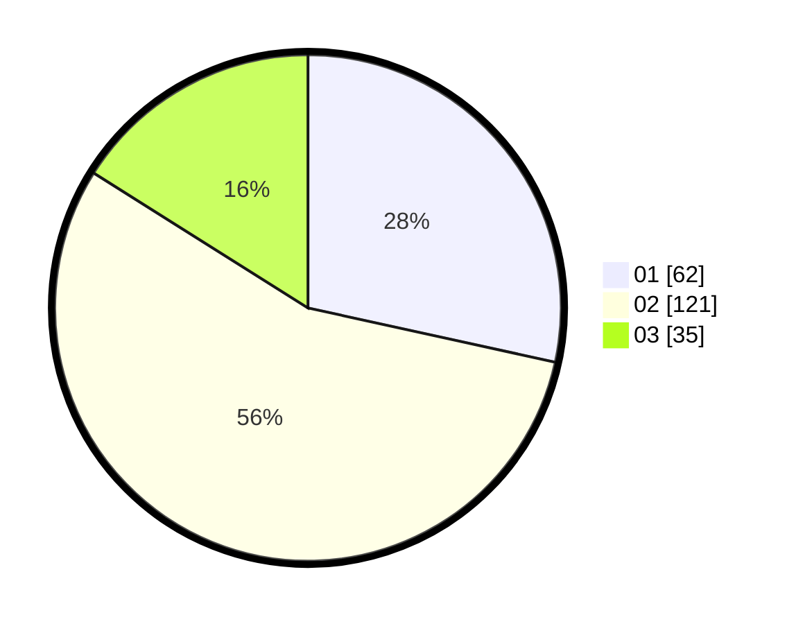

# Hasil

Hasil perolehan suara paslon dapat dilihat pada file paslon-01.txt, paslon-02.txt, dan paslon-03.txt.

Jika tidak ada, artinya data tersebut belum ada pada SIREKAP.

## Perolehan Suara

 * Paslon 01: **62**.
 * Paslon 02: **121**.
 * Paslon 03: **35**.

## Foto C Plano

https://sirekap-obj-formc.kpu.go.id/3992/pemilu/ppwp/31/74/06/10/02/3174061002078-20240218-175946--363c9408-66e7-47e3-9b57-1d98ccad213a.jpg

https://sirekap-obj-formc.kpu.go.id/3992/pemilu/ppwp/31/74/06/10/02/3174061002078-20240218-180043--a802fd7c-1794-4a14-931b-7caae3cb9bcf.jpg

https://sirekap-obj-formc.kpu.go.id/3992/pemilu/ppwp/31/74/06/10/02/3174061002078-20240218-180106--32c04511-80a4-427a-ab86-eb41d7810ebd.jpg

## DATA PEMILIH TETAP

Jumlah pemilih dalam DPT: **297**.
 * L: **143**.
 * P: **154**.

## DATA PENGGUNA HAK PILIH

Jumlah pengguna hak pilih dalam DPT: **222**.
 * L: **103**.
 * P: **179**.

Jumlah pengguna hak pilih dalam DPTb: **1**.
 * L: **0**.
 * P: **7**.

Jumlah pengguna hak pilih dalam DPK: **1**.
 * L: **1**.
 * P: **0**.

Jumlah pengguna hak pilih: **224**.
 * L: **104**.
 * P: **120**.

## JUMLAH SUARA SAH DAN TIDAK SAH

JUMLAH SELURUH SUARA SAH: **218**.

JUMLAH SUARA TIDAK SAH: **6**.

JUMLAH SELURUH SUARA SAH DAN SUARA TIDAK SAH: **224**.
