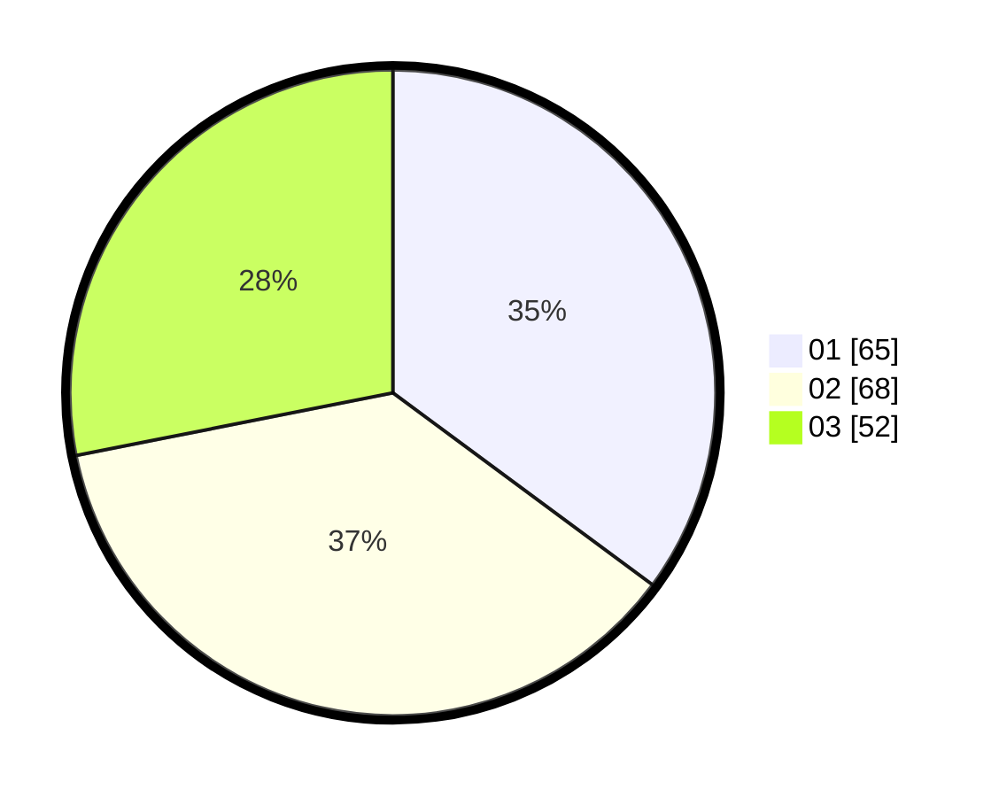

# Hasil

Hasil perolehan suara paslon dapat dilihat pada file paslon-01.txt, paslon-02.txt, dan paslon-03.txt.

Jika tidak ada, artinya data tersebut belum ada pada SIREKAP.

## Perolehan Suara

 * Paslon 01: **65**.
 * Paslon 02: **68**.
 * Paslon 03: **52**.

## Foto C Plano

https://sirekap-obj-formc.kpu.go.id/f3a7/pemilu/ppwp/31/74/06/10/02/3174061002079-20240218-180740--f8971273-dcc9-421a-a520-a96998c89907.jpg

https://sirekap-obj-formc.kpu.go.id/f3a7/pemilu/ppwp/31/74/06/10/02/3174061002079-20240218-180918--3a4b0d18-b0b6-4f9a-bd08-118e974bab20.jpg

https://sirekap-obj-formc.kpu.go.id/f3a7/pemilu/ppwp/31/74/06/10/02/3174061002079-20240218-181003--cdca36e1-18de-4476-bd27-ca5ea9058fb3.jpg

## DATA PEMILIH TETAP

Jumlah pemilih dalam DPT: **219**.
 * L: **104**.
 * P: **115**.

## DATA PENGGUNA HAK PILIH

Jumlah pengguna hak pilih dalam DPT: **182**.
 * L: **86**.
 * P: **96**.

Jumlah pengguna hak pilih dalam DPTb: **8**.
 * L: **83**.
 * P: **5**.

Jumlah pengguna hak pilih dalam DPK: **3**.
 * L: **0**.
 * P: **3**.

Jumlah pengguna hak pilih: **193**.
 * L: **84**.
 * P: **104**.

## JUMLAH SUARA SAH DAN TIDAK SAH

JUMLAH SELURUH SUARA SAH: **185**.

JUMLAH SUARA TIDAK SAH: **8**.

JUMLAH SELURUH SUARA SAH DAN SUARA TIDAK SAH: **193**.
