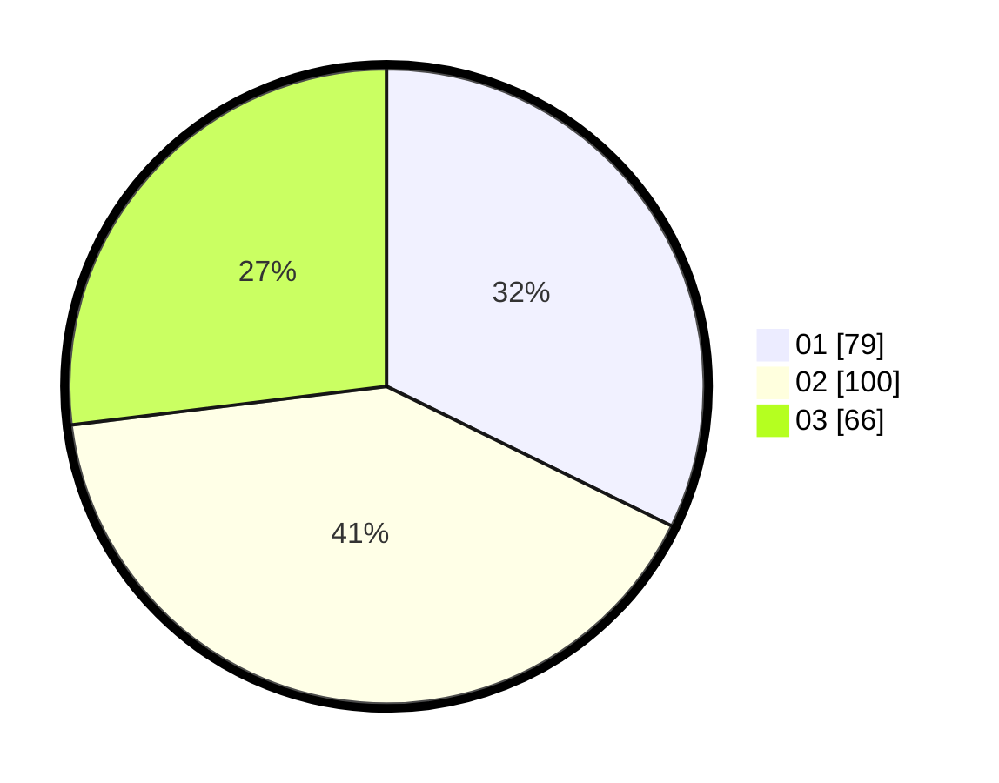

# Hasil

Hasil perolehan suara paslon dapat dilihat pada file paslon-01.txt, paslon-02.txt, dan paslon-03.txt.

Jika tidak ada, artinya data tersebut belum ada pada SIREKAP.

## Perolehan Suara

 * Paslon 01: **79**.
 * Paslon 02: **100**.
 * Paslon 03: **66**.

## Foto C Plano

https://sirekap-obj-formc.kpu.go.id/7a7d/pemilu/ppwp/31/74/06/10/02/3174061002080-20240214-233131--b3d3ca50-0ee2-4110-a8d3-38356d8fd704.jpg

https://sirekap-obj-formc.kpu.go.id/7a7d/pemilu/ppwp/31/74/06/10/02/3174061002080-20240214-233159--9c21dafd-0ad6-424c-a1fa-54a035087c61.jpg

https://sirekap-obj-formc.kpu.go.id/7a7d/pemilu/ppwp/31/74/06/10/02/3174061002080-20240214-233248--3cc2c3f9-e72b-40f2-82f5-112cd809fd65.jpg

## DATA PEMILIH TETAP

Jumlah pemilih dalam DPT: **289**.
 * L: **144**.
 * P: **145**.

## DATA PENGGUNA HAK PILIH

Jumlah pengguna hak pilih dalam DPT: **233**.
 * L: **110**.
 * P: **123**.

Jumlah pengguna hak pilih dalam DPTb: **4**.
 * L: **0**.
 * P: **4**.

Jumlah pengguna hak pilih dalam DPK: **8**.
 * L: **6**.
 * P: **2**.

Jumlah pengguna hak pilih: **245**.
 * L: **116**.
 * P: **129**.

## JUMLAH SUARA SAH DAN TIDAK SAH

JUMLAH SELURUH SUARA SAH: **245**.

JUMLAH SUARA TIDAK SAH: **0**.

JUMLAH SELURUH SUARA SAH DAN SUARA TIDAK SAH: **245**.
