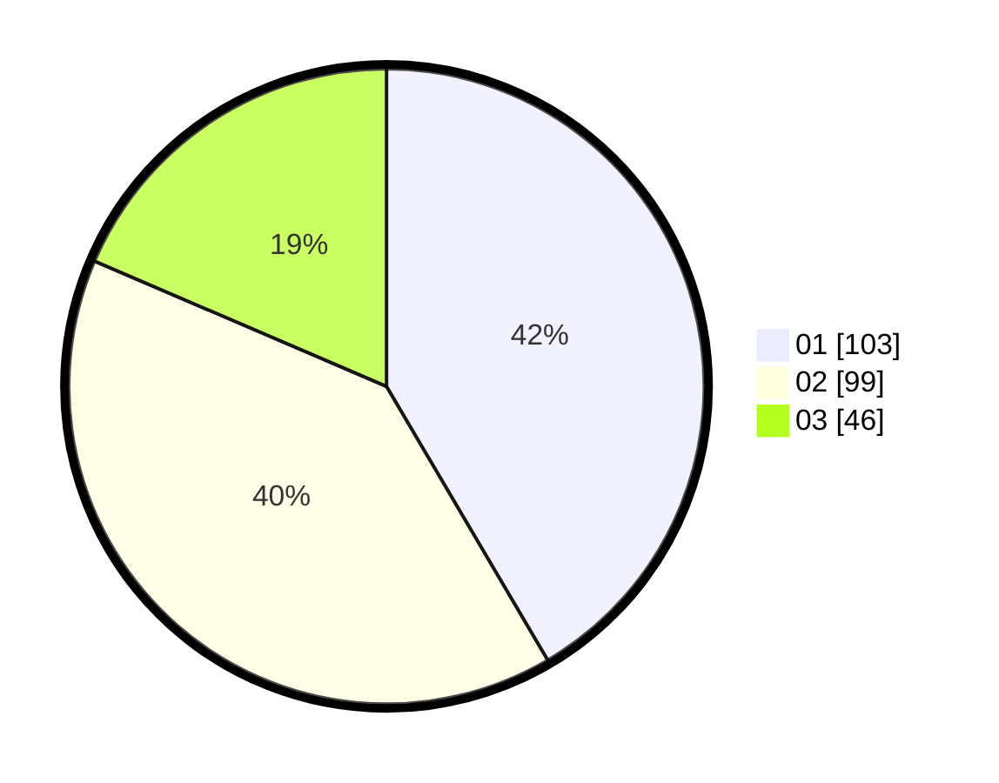

# Hasil

Hasil perolehan suara paslon dapat dilihat pada file paslon-01.txt, paslon-02.txt, dan paslon-03.txt.

Jika tidak ada, artinya data tersebut belum ada pada SIREKAP.

## Perolehan Suara

 * Paslon 01: **103**.
 * Paslon 02: **99**.
 * Paslon 03: **46**.

## Foto C Plano

https://sirekap-obj-formc.kpu.go.id/3939/pemilu/ppwp/31/74/06/10/02/3174061002081-20240218-155331--bc145c1a-d42e-4795-97e3-12ef518d00c9.jpg

https://sirekap-obj-formc.kpu.go.id/3939/pemilu/ppwp/31/74/06/10/02/3174061002081-20240218-155955--1aec0fde-170a-4a8a-a9ab-96332ff3353e.jpg

https://sirekap-obj-formc.kpu.go.id/3939/pemilu/ppwp/31/74/06/10/02/3174061002081-20240218-160056--e7c78380-8e73-4572-915c-030f86752646.jpg

## DATA PEMILIH TETAP

Jumlah pemilih dalam DPT: **292**.
 * L: **140**.
 * P: **152**.

## DATA PENGGUNA HAK PILIH

Jumlah pengguna hak pilih dalam DPT: **230**.
 * L: **113**.
 * P: **117**.

Jumlah pengguna hak pilih dalam DPTb: **19**.
 * L: **10**.
 * P: **9**.

Jumlah pengguna hak pilih dalam DPK: **0**.
 * L: **0**.
 * P: **0**.

Jumlah pengguna hak pilih: **249**.
 * L: **123**.
 * P: **126**.

## JUMLAH SUARA SAH DAN TIDAK SAH

JUMLAH SELURUH SUARA SAH: **248**.

JUMLAH SUARA TIDAK SAH: **1**.

JUMLAH SELURUH SUARA SAH DAN SUARA TIDAK SAH: **249**.
