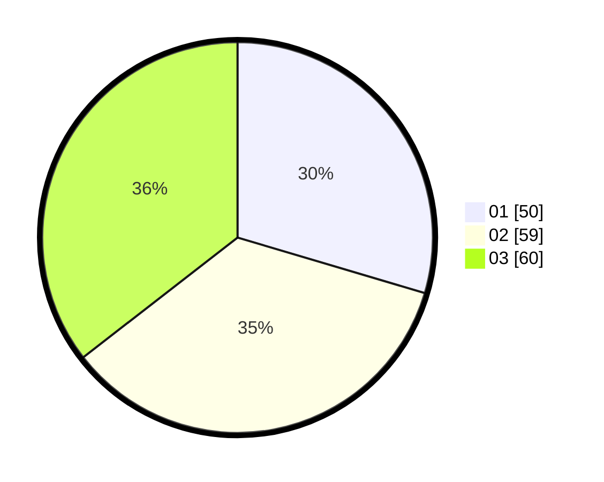

# Hasil

Hasil perolehan suara paslon dapat dilihat pada file paslon-01.txt, paslon-02.txt, dan paslon-03.txt.

Jika tidak ada, artinya data tersebut belum ada pada SIREKAP.

## Perolehan Suara

 * Paslon 01: **50**.
 * Paslon 02: **59**.
 * Paslon 03: **60**.

## Foto C Plano

https://sirekap-obj-formc.kpu.go.id/3c5e/pemilu/ppwp/31/74/06/10/02/3174061002084-20240215-222752--bbe0b3c3-dfa0-490d-93c8-dbcea2513809.jpg

https://sirekap-obj-formc.kpu.go.id/3c5e/pemilu/ppwp/31/74/06/10/02/3174061002084-20240214-204043--f0ab138a-347f-45bd-a977-50762dea71d8.jpg

https://sirekap-obj-formc.kpu.go.id/3c5e/pemilu/ppwp/31/74/06/10/02/3174061002084-20240214-193815--58e6e33b-caa2-495d-9680-136cd68dbcf6.jpg

## DATA PEMILIH TETAP

Jumlah pemilih dalam DPT: **202**.
 * L: **92**.
 * P: **110**.

## DATA PENGGUNA HAK PILIH

Jumlah pengguna hak pilih dalam DPT: **163**.
 * L: **69**.
 * P: **94**.

Jumlah pengguna hak pilih dalam DPTb: **4**.
 * L: **2**.
 * P: **2**.

Jumlah pengguna hak pilih dalam DPK: **4**.
 * L: **0**.
 * P: **4**.

Jumlah pengguna hak pilih: **171**.
 * L: **71**.
 * P: **100**.

## JUMLAH SUARA SAH DAN TIDAK SAH

JUMLAH SELURUH SUARA SAH: **169**.

JUMLAH SUARA TIDAK SAH: **2**.

JUMLAH SELURUH SUARA SAH DAN SUARA TIDAK SAH: **171**.
