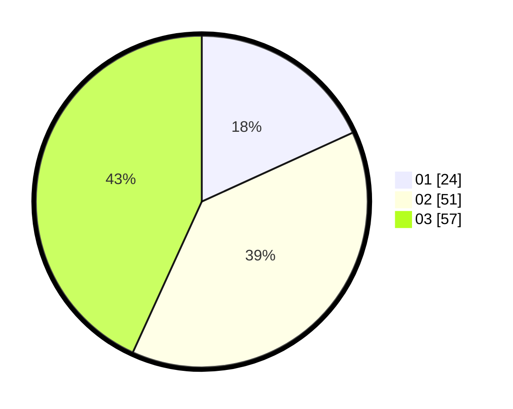

# Hasil

Hasil perolehan suara paslon dapat dilihat pada file paslon-01.txt, paslon-02.txt, dan paslon-03.txt.

Jika tidak ada, artinya data tersebut belum ada pada SIREKAP.

## Perolehan Suara

 * Paslon 01: **24**.
 * Paslon 02: **51**.
 * Paslon 03: **57**.

## Foto C Plano

https://sirekap-obj-formc.kpu.go.id/5942/pemilu/ppwp/31/74/06/10/02/3174061002085-20240218-160452--5c0b608c-14fd-4536-9305-d20a988d13bd.jpg

https://sirekap-obj-formc.kpu.go.id/5942/pemilu/ppwp/31/74/06/10/02/3174061002085-20240218-160619--23ccb468-a997-4d2d-95d0-f90a95afb79f.jpg

https://sirekap-obj-formc.kpu.go.id/5942/pemilu/ppwp/31/74/06/10/02/3174061002085-20240218-160808--e34961e7-7d30-4610-8f4d-60b581497016.jpg

## DATA PEMILIH TETAP

Jumlah pemilih dalam DPT: **158**.
 * L: **69**.
 * P: **89**.

## DATA PENGGUNA HAK PILIH

Jumlah pengguna hak pilih dalam DPT: **128**.
 * L: **55**.
 * P: **73**.

Jumlah pengguna hak pilih dalam DPTb: **5**.
 * L: **1**.
 * P: **4**.

Jumlah pengguna hak pilih dalam DPK: **0**.
 * L: **1**.
 * P: **1**.

Jumlah pengguna hak pilih: **135**.
 * L: **57**.
 * P: **78**.

## JUMLAH SUARA SAH DAN TIDAK SAH

JUMLAH SELURUH SUARA SAH: **132**.

JUMLAH SUARA TIDAK SAH: **3**.

JUMLAH SELURUH SUARA SAH DAN SUARA TIDAK SAH: **135**.
