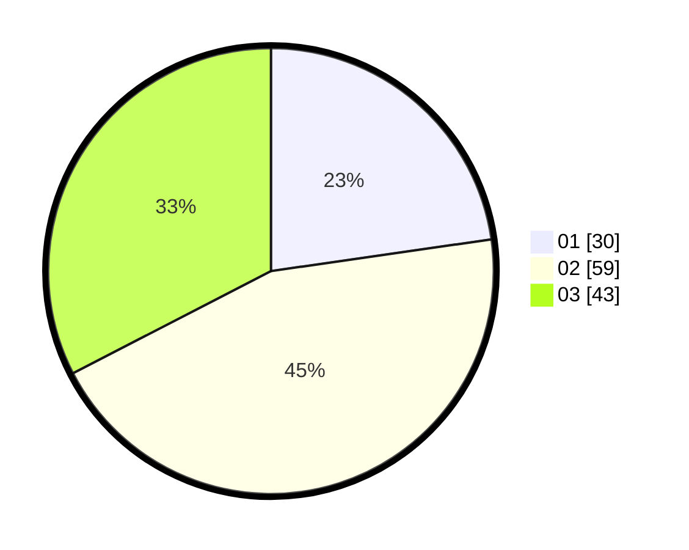

# Hasil

Hasil perolehan suara paslon dapat dilihat pada file paslon-01.txt, paslon-02.txt, dan paslon-03.txt.

Jika tidak ada, artinya data tersebut belum ada pada SIREKAP.

## Perolehan Suara

 * Paslon 01: **30**.
 * Paslon 02: **59**.
 * Paslon 03: **43**.

## Foto C Plano

https://sirekap-obj-formc.kpu.go.id/3270/pemilu/ppwp/31/74/06/10/02/3174061002086-20240215-204120--291169e3-ee30-41c3-85c6-7a38ead82103.jpg

https://sirekap-obj-formc.kpu.go.id/3270/pemilu/ppwp/31/74/06/10/02/3174061002086-20240215-203251--d6d0b189-f60e-4472-b61b-e0eb813c6d82.jpg

https://sirekap-obj-formc.kpu.go.id/3270/pemilu/ppwp/31/74/06/10/02/3174061002086-20240215-213018--7bece668-54b7-4069-9066-083a4783f01b.jpg
