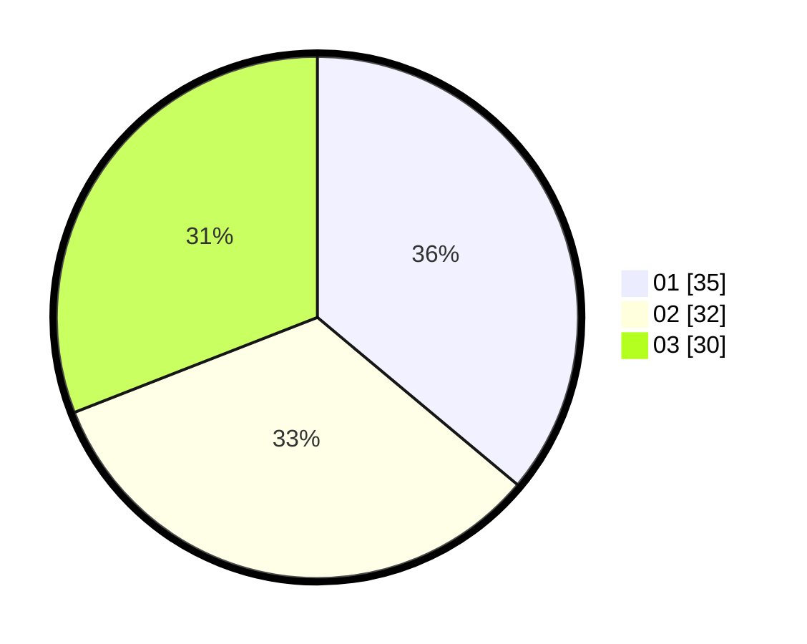

# Hasil

Hasil perolehan suara paslon dapat dilihat pada file paslon-01.txt, paslon-02.txt, dan paslon-03.txt.

Jika tidak ada, artinya data tersebut belum ada pada SIREKAP.

## Perolehan Suara

 * Paslon 01: **35**.
 * Paslon 02: **32**.
 * Paslon 03: **30**.

## Foto C Plano

https://sirekap-obj-formc.kpu.go.id/aeba/pemilu/ppwp/31/74/06/10/02/3174061002089-20240214-155739--5d524abe-b1ab-4c0e-a3ad-fdde1c44bd0c.jpg

https://sirekap-obj-formc.kpu.go.id/aeba/pemilu/ppwp/31/74/06/10/02/3174061002089-20240214-155830--4daf16d6-ad0e-4fa8-b9b9-0c450e77537c.jpg

https://sirekap-obj-formc.kpu.go.id/aeba/pemilu/ppwp/31/74/06/10/02/3174061002089-20240214-194820--19934975-bc2e-454a-b33f-bddacb188988.jpg

## DATA PEMILIH TETAP

Jumlah pemilih dalam DPT: **113**.
 * L: **52**.
 * P: **61**.

## DATA PENGGUNA HAK PILIH

Jumlah pengguna hak pilih dalam DPT: **101**.
 * L: **46**.
 * P: **55**.

Jumlah pengguna hak pilih dalam DPTb: **1**.
 * L: **1**.
 * P: **0**.

Jumlah pengguna hak pilih dalam DPK: **0**.
 * L: **0**.
 * P: **0**.

Jumlah pengguna hak pilih: **102**.
 * L: **47**.
 * P: **55**.

## JUMLAH SUARA SAH DAN TIDAK SAH

JUMLAH SELURUH SUARA SAH: **97**.

JUMLAH SUARA TIDAK SAH: **5**.

JUMLAH SELURUH SUARA SAH DAN SUARA TIDAK SAH: **102**.
