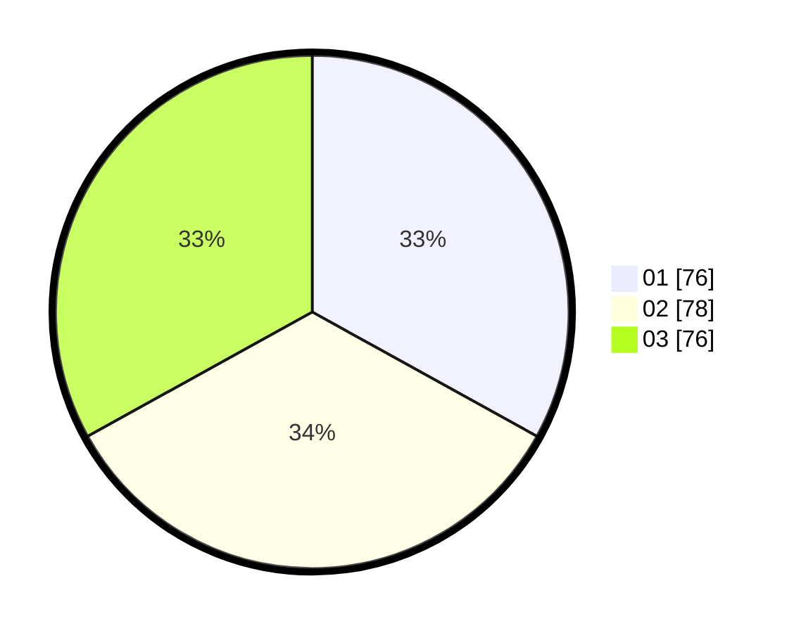

# Hasil

Hasil perolehan suara paslon dapat dilihat pada file paslon-01.txt, paslon-02.txt, dan paslon-03.txt.

Jika tidak ada, artinya data tersebut belum ada pada SIREKAP.

## Perolehan Suara

 * Paslon 01: **76**.
 * Paslon 02: **78**.
 * Paslon 03: **76**.

## Foto C Plano

https://sirekap-obj-formc.kpu.go.id/ef3e/pemilu/ppwp/31/74/06/10/02/3174061002092-20240218-174227--a29f191a-8578-492f-b071-cdaaa00bcf3b.jpg

https://sirekap-obj-formc.kpu.go.id/ef3e/pemilu/ppwp/31/74/06/10/02/3174061002092-20240218-174301--5685808a-5096-4d86-8929-85b2448c006f.jpg

https://sirekap-obj-formc.kpu.go.id/ef3e/pemilu/ppwp/31/74/06/10/02/3174061002092-20240218-174325--83f3c023-f390-4580-850f-e31dfa884fdf.jpg

## DATA PEMILIH TETAP

Jumlah pemilih dalam DPT: **297**.
 * L: **135**.
 * P: **162**.

## DATA PENGGUNA HAK PILIH

Jumlah pengguna hak pilih dalam DPT: **229**.
 * L: **106**.
 * P: **123**.

Jumlah pengguna hak pilih dalam DPTb: **7**.
 * L: **0**.
 * P: **7**.

Jumlah pengguna hak pilih dalam DPK: **1**.
 * L: **0**.
 * P: **1**.

Jumlah pengguna hak pilih: **237**.
 * L: **106**.
 * P: **131**.

## JUMLAH SUARA SAH DAN TIDAK SAH

JUMLAH SELURUH SUARA SAH: **230**.

JUMLAH SUARA TIDAK SAH: **7**.

JUMLAH SELURUH SUARA SAH DAN SUARA TIDAK SAH: **237**.
