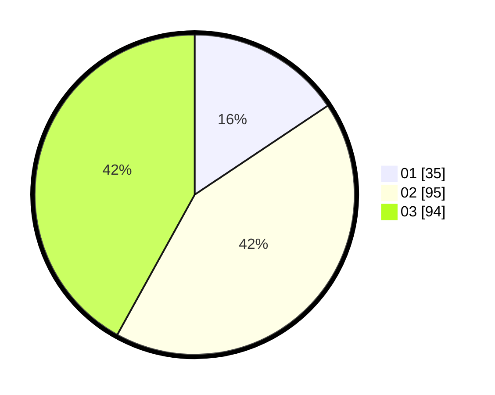

# Hasil

Hasil perolehan suara paslon dapat dilihat pada file paslon-01.txt, paslon-02.txt, dan paslon-03.txt.

Jika tidak ada, artinya data tersebut belum ada pada SIREKAP.

## Perolehan Suara

 * Paslon 01: **35**.
 * Paslon 02: **95**.
 * Paslon 03: **94**.

## Foto C Plano

https://sirekap-obj-formc.kpu.go.id/3c74/pemilu/ppwp/31/74/06/10/02/3174061002094-20240218-165905--2fd9dda3-f1f2-44df-b23d-c6199415f047.jpg

https://sirekap-obj-formc.kpu.go.id/3c74/pemilu/ppwp/31/74/06/10/02/3174061002094-20240218-170000--6e417340-ca42-4c57-9b44-6b955aabb475.jpg

https://sirekap-obj-formc.kpu.go.id/3c74/pemilu/ppwp/31/74/06/10/02/3174061002094-20240218-170208--4b2db690-d951-4465-8bee-8b84b5e9c308.jpg

## DATA PEMILIH TETAP

Jumlah pemilih dalam DPT: **274**.
 * L: **121**.
 * P: **153**.

## DATA PENGGUNA HAK PILIH

Jumlah pengguna hak pilih dalam DPT: **294**.
 * L: **96**.
 * P: **108**.

Jumlah pengguna hak pilih dalam DPTb: **18**.
 * L: **7**.
 * P: **11**.

Jumlah pengguna hak pilih dalam DPK: **3**.
 * L: **1**.
 * P: **2**.

Jumlah pengguna hak pilih: **225**.
 * L: **104**.
 * P: **121**.

## JUMLAH SUARA SAH DAN TIDAK SAH

JUMLAH SELURUH SUARA SAH: **224**.

JUMLAH SUARA TIDAK SAH: **1**.

JUMLAH SELURUH SUARA SAH DAN SUARA TIDAK SAH: **225**.
