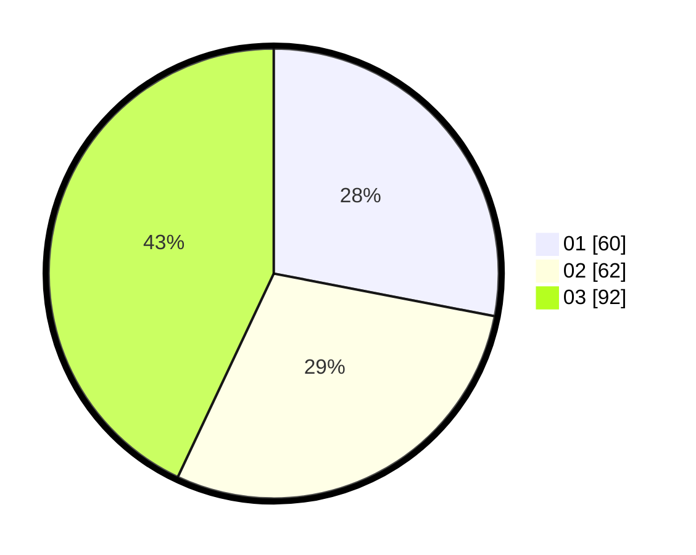

# Hasil

Hasil perolehan suara paslon dapat dilihat pada file paslon-01.txt, paslon-02.txt, dan paslon-03.txt.

Jika tidak ada, artinya data tersebut belum ada pada SIREKAP.

## Perolehan Suara

 * Paslon 01: **60**.
 * Paslon 02: **62**.
 * Paslon 03: **92**.

## Foto C Plano

https://sirekap-obj-formc.kpu.go.id/19b3/pemilu/ppwp/31/74/06/10/02/3174061002096-20240218-173923--74b949f5-66d3-41dd-be0d-0a6dc85662ae.jpg

https://sirekap-obj-formc.kpu.go.id/19b3/pemilu/ppwp/31/74/06/10/02/3174061002096-20240218-174007--561ae2e1-6351-4366-80de-5aa89eb5fa29.jpg

https://sirekap-obj-formc.kpu.go.id/19b3/pemilu/ppwp/31/74/06/10/02/3174061002096-20240218-174033--9a49e950-3ea3-4bc7-8322-075c0e4f8a43.jpg

## DATA PEMILIH TETAP

Jumlah pemilih dalam DPT: **199**.
 * L: **95**.
 * P: **104**.

## DATA PENGGUNA HAK PILIH

Jumlah pengguna hak pilih dalam DPT: **199**.
 * L: **95**.
 * P: **104**.

Jumlah pengguna hak pilih dalam DPTb: **11**.
 * L: **7**.
 * P: **4**.

Jumlah pengguna hak pilih dalam DPK: **6**.
 * L: **2**.
 * P: **4**.

Jumlah pengguna hak pilih: **216**.
 * L: **104**.
 * P: **112**.

## JUMLAH SUARA SAH DAN TIDAK SAH

JUMLAH SELURUH SUARA SAH: **214**.

JUMLAH SUARA TIDAK SAH: **2**.

JUMLAH SELURUH SUARA SAH DAN SUARA TIDAK SAH: **216**.
