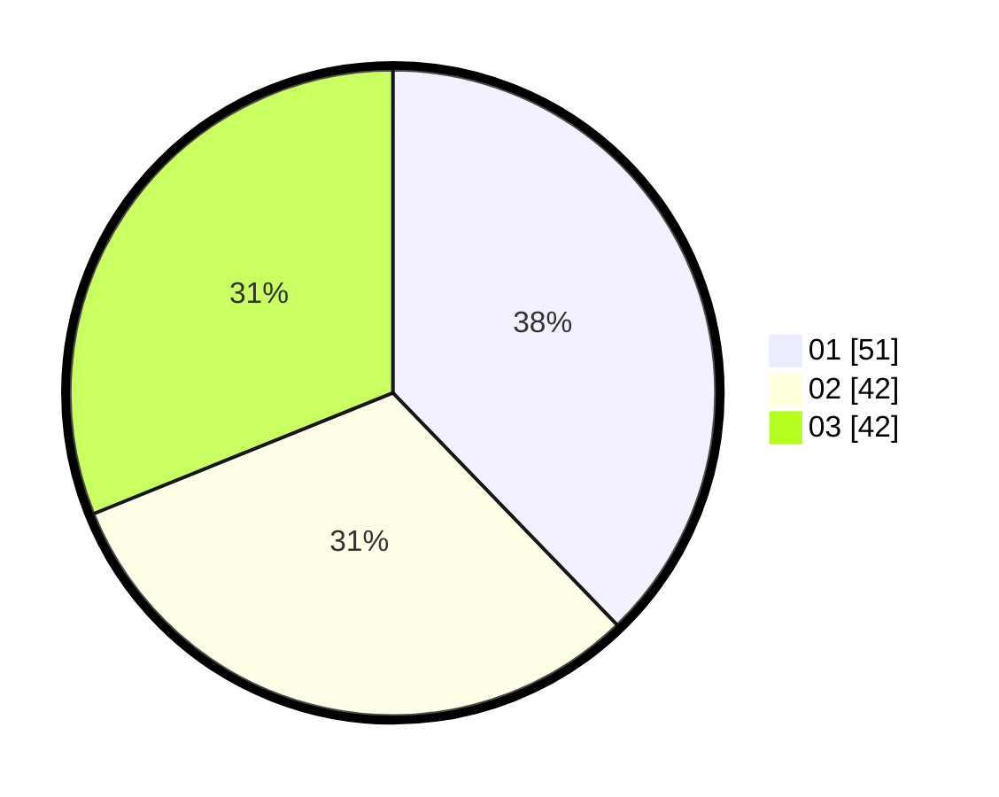

# Hasil

Hasil perolehan suara paslon dapat dilihat pada file paslon-01.txt, paslon-02.txt, dan paslon-03.txt.

Jika tidak ada, artinya data tersebut belum ada pada SIREKAP.

## Perolehan Suara

 * Paslon 01: **51**.
 * Paslon 02: **42**.
 * Paslon 03: **42**.

## Foto C Plano

https://sirekap-obj-formc.kpu.go.id/dbc7/pemilu/ppwp/31/74/06/10/02/3174061002099-20240214-205627--841fc1f1-c02d-48bb-be0c-16a1a3e3cdce.jpg

https://sirekap-obj-formc.kpu.go.id/dbc7/pemilu/ppwp/31/74/06/10/02/3174061002099-20240214-205652--7b58ceea-788c-4138-a24d-93acb9171534.jpg

https://sirekap-obj-formc.kpu.go.id/dbc7/pemilu/ppwp/31/74/06/10/02/3174061002099-20240214-205717--ab824330-14cb-4c1f-9d21-f00da869614a.jpg
