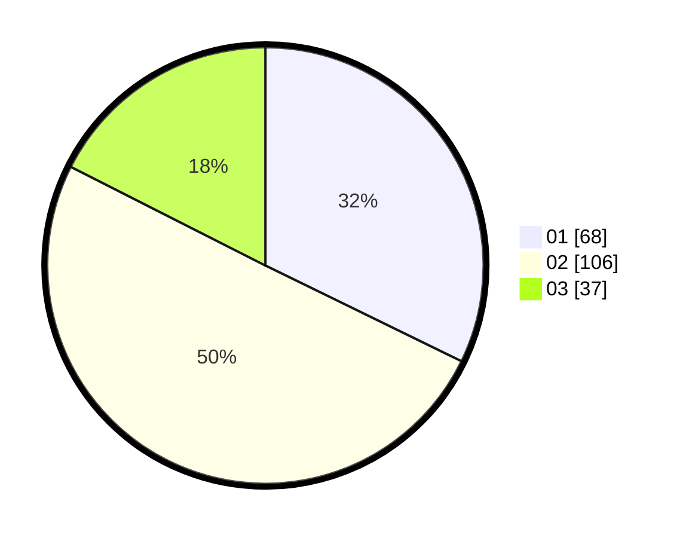

# Hasil

Hasil perolehan suara paslon dapat dilihat pada file paslon-01.txt, paslon-02.txt, dan paslon-03.txt.

Jika tidak ada, artinya data tersebut belum ada pada SIREKAP.

## Perolehan Suara

 * Paslon 01: **68**.
 * Paslon 02: **106**.
 * Paslon 03: **37**.

## Foto C Plano

https://sirekap-obj-formc.kpu.go.id/328c/pemilu/ppwp/31/74/06/10/02/3174061002102-20240214-221726--7be86a2b-13f3-4194-8fea-a9b02a20a259.jpg

https://sirekap-obj-formc.kpu.go.id/328c/pemilu/ppwp/31/74/06/10/02/3174061002102-20240214-221754--f8f717dd-b715-4137-b321-c9bafaa6f976.jpg

https://sirekap-obj-formc.kpu.go.id/328c/pemilu/ppwp/31/74/06/10/02/3174061002102-20240214-221849--4d2408f2-3ae8-41bc-837a-43e1f54c10d4.jpg
