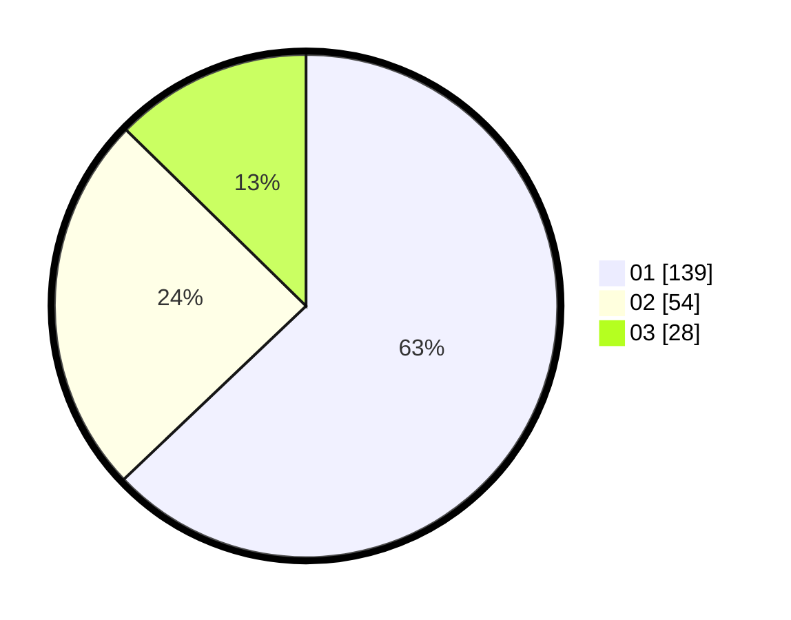

# Hasil

Hasil perolehan suara paslon dapat dilihat pada file paslon-01.txt, paslon-02.txt, dan paslon-03.txt.

Jika tidak ada, artinya data tersebut belum ada pada SIREKAP.

## Perolehan Suara

 * Paslon 01: **139**.
 * Paslon 02: **54**.
 * Paslon 03: **28**.

## Foto C Plano

https://sirekap-obj-formc.kpu.go.id/17a7/pemilu/ppwp/31/74/06/10/02/3174061002104-20240217-105444--65370511-f712-4f1e-a9db-ee9b9f46cd4d.jpg

https://sirekap-obj-formc.kpu.go.id/17a7/pemilu/ppwp/31/74/06/10/02/3174061002104-20240217-105757--fcb55bfc-445b-47a2-822e-a8c96a5e5f38.jpg

https://sirekap-obj-formc.kpu.go.id/17a7/pemilu/ppwp/31/74/06/10/02/3174061002104-20240214-230635--212c04b4-52a9-4cfb-91be-d8e4aa0e9ea4.jpg

## DATA PEMILIH TETAP

Jumlah pemilih dalam DPT: **283**.
 * L: **136**.
 * P: **147**.

## DATA PENGGUNA HAK PILIH

Jumlah pengguna hak pilih dalam DPT: **278**.
 * L: **108**.
 * P: **110**.

Jumlah pengguna hak pilih dalam DPTb: **5**.
 * L: **2**.
 * P: **3**.

Jumlah pengguna hak pilih dalam DPK: **4**.
 * L: **7**.
 * P: **3**.

Jumlah pengguna hak pilih: **227**.
 * L: **111**.
 * P: **116**.

## JUMLAH SUARA SAH DAN TIDAK SAH

JUMLAH SELURUH SUARA SAH: **221**.

JUMLAH SUARA TIDAK SAH: **6**.

JUMLAH SELURUH SUARA SAH DAN SUARA TIDAK SAH: **227**.
