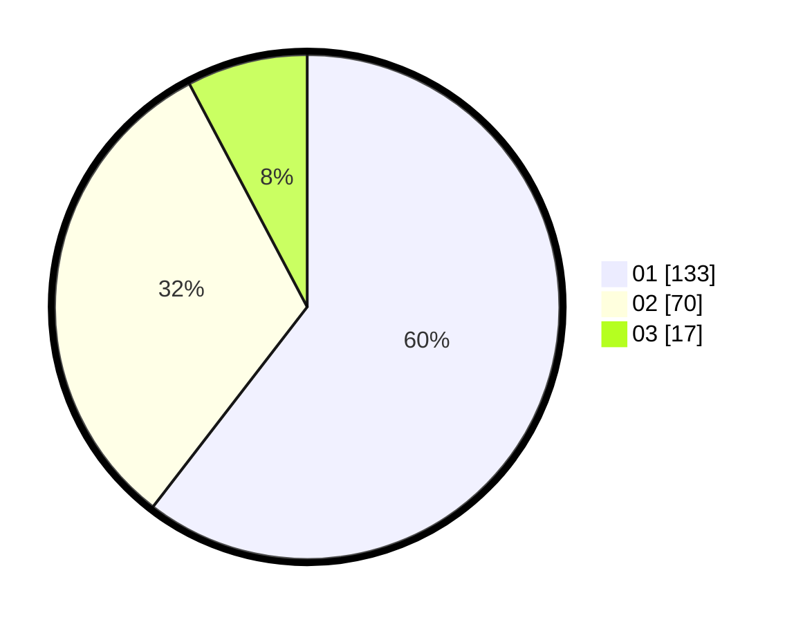

# Hasil

Hasil perolehan suara paslon dapat dilihat pada file paslon-01.txt, paslon-02.txt, dan paslon-03.txt.

Jika tidak ada, artinya data tersebut belum ada pada SIREKAP.

## Perolehan Suara

 * Paslon 01: **133**.
 * Paslon 02: **70**.
 * Paslon 03: **17**.

## Foto C Plano

https://sirekap-obj-formc.kpu.go.id/7c98/pemilu/ppwp/31/74/06/10/02/3174061002105-20240217-110146--53ae807d-8486-4f90-9309-d9c30a8378b5.jpg

https://sirekap-obj-formc.kpu.go.id/7c98/pemilu/ppwp/31/74/06/10/02/3174061002105-20240217-105911--87e6f85e-99d6-4f49-aa08-423c9e94e167.jpg

https://sirekap-obj-formc.kpu.go.id/7c98/pemilu/ppwp/31/74/06/10/02/3174061002105-20240217-110025--0ce5e6d0-e5c6-4b98-b8d8-b7974cc6d462.jpg

## DATA PEMILIH TETAP

Jumlah pemilih dalam DPT: **273**.
 * L: **137**.
 * P: **136**.

## DATA PENGGUNA HAK PILIH

Jumlah pengguna hak pilih dalam DPT: **214**.
 * L: **103**.
 * P: **111**.

Jumlah pengguna hak pilih dalam DPTb: **4**.
 * L: **1**.
 * P: **3**.

Jumlah pengguna hak pilih dalam DPK: **2**.
 * L: **2**.
 * P: **0**.

Jumlah pengguna hak pilih: **220**.
 * L: **106**.
 * P: **114**.

## JUMLAH SUARA SAH DAN TIDAK SAH

JUMLAH SELURUH SUARA SAH: **220**.

JUMLAH SUARA TIDAK SAH: **1**.

JUMLAH SELURUH SUARA SAH DAN SUARA TIDAK SAH: **221**.
