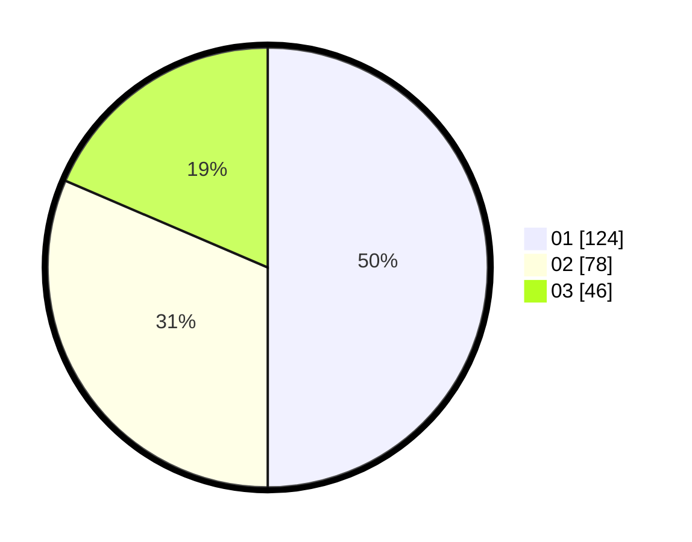

# Hasil

Hasil perolehan suara paslon dapat dilihat pada file paslon-01.txt, paslon-02.txt, dan paslon-03.txt.

Jika tidak ada, artinya data tersebut belum ada pada SIREKAP.

## Perolehan Suara

 * Paslon 01: **124**.
 * Paslon 02: **78**.
 * Paslon 03: **46**.

## Foto C Plano

https://sirekap-obj-formc.kpu.go.id/e8fc/pemilu/ppwp/31/74/06/10/02/3174061002106-20240214-191303--b176f896-e464-4e45-b4c3-460fafe0fee5.jpg

https://sirekap-obj-formc.kpu.go.id/e8fc/pemilu/ppwp/31/74/06/10/02/3174061002106-20240214-202503--4fe191ca-4041-41fd-bdc1-034b87af4478.jpg

https://sirekap-obj-formc.kpu.go.id/e8fc/pemilu/ppwp/31/74/06/10/02/3174061002106-20240214-191250--5bf73d83-2133-444f-87f9-72f8803fadbe.jpg

## DATA PEMILIH TETAP

Jumlah pemilih dalam DPT: **274**.
 * L: **140**.
 * P: **134**.

## DATA PENGGUNA HAK PILIH

Jumlah pengguna hak pilih dalam DPT: **244**.
 * L: **128**.
 * P: **116**.

Jumlah pengguna hak pilih dalam DPTb: **0**.
 * L: **0**.
 * P: **0**.

Jumlah pengguna hak pilih dalam DPK: **7**.
 * L: **4**.
 * P: **3**.

Jumlah pengguna hak pilih: **251**.
 * L: **132**.
 * P: **119**.

## JUMLAH SUARA SAH DAN TIDAK SAH

JUMLAH SELURUH SUARA SAH: **248**.

JUMLAH SUARA TIDAK SAH: **3**.

JUMLAH SELURUH SUARA SAH DAN SUARA TIDAK SAH: **251**.
