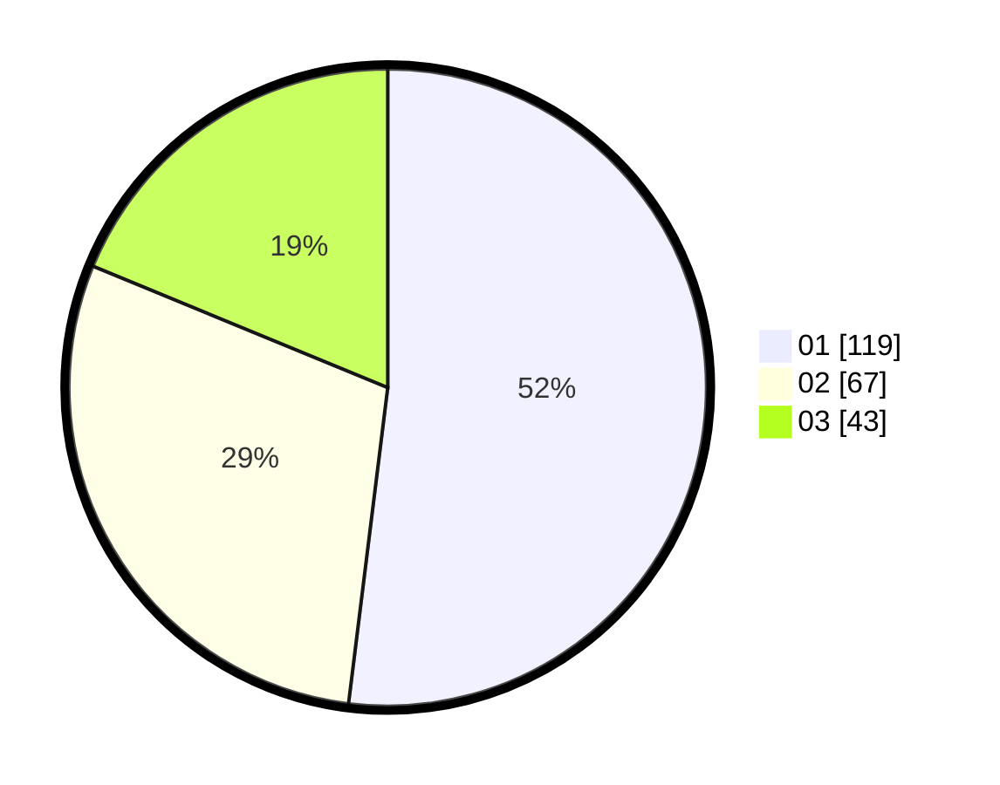

# Hasil

Hasil perolehan suara paslon dapat dilihat pada file paslon-01.txt, paslon-02.txt, dan paslon-03.txt.

Jika tidak ada, artinya data tersebut belum ada pada SIREKAP.

## Perolehan Suara

 * Paslon 01: **119**.
 * Paslon 02: **67**.
 * Paslon 03: **43**.

## Foto C Plano

https://sirekap-obj-formc.kpu.go.id/84d2/pemilu/ppwp/31/74/06/10/02/3174061002107-20240217-111038--4ec34caa-cc0e-435f-98d0-b0aea5aeaaab.jpg

https://sirekap-obj-formc.kpu.go.id/84d2/pemilu/ppwp/31/74/06/10/02/3174061002107-20240217-110848--12511570-fd02-45ae-9fb9-0ecd5325bb95.jpg

https://sirekap-obj-formc.kpu.go.id/84d2/pemilu/ppwp/31/74/06/10/02/3174061002107-20240217-110928--54e69c8a-4c88-483e-a1ed-6bda163a4c7a.jpg

## DATA PEMILIH TETAP

Jumlah pemilih dalam DPT: **280**.
 * L: **136**.
 * P: **144**.

## DATA PENGGUNA HAK PILIH

Jumlah pengguna hak pilih dalam DPT: **227**.
 * L: **107**.
 * P: **120**.

Jumlah pengguna hak pilih dalam DPTb: **803**.
 * L: **0**.
 * P: **3**.

Jumlah pengguna hak pilih dalam DPK: **1**.
 * L: **0**.
 * P: **1**.

Jumlah pengguna hak pilih: **231**.
 * L: **107**.
 * P: **124**.

## JUMLAH SUARA SAH DAN TIDAK SAH

JUMLAH SELURUH SUARA SAH: **229**.

JUMLAH SUARA TIDAK SAH: **2**.

JUMLAH SELURUH SUARA SAH DAN SUARA TIDAK SAH: **231**.
