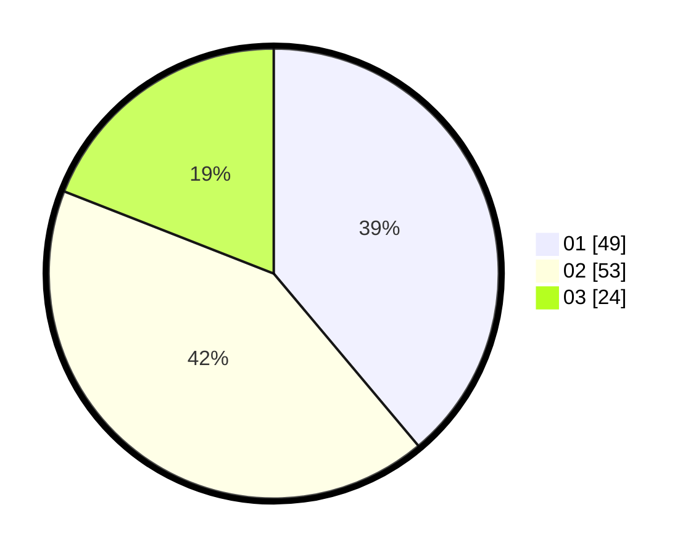

# Hasil

Hasil perolehan suara paslon dapat dilihat pada file paslon-01.txt, paslon-02.txt, dan paslon-03.txt.

Jika tidak ada, artinya data tersebut belum ada pada SIREKAP.

## Perolehan Suara

 * Paslon 01: **49**.
 * Paslon 02: **53**.
 * Paslon 03: **24**.

## Foto C Plano

https://sirekap-obj-formc.kpu.go.id/74a5/pemilu/ppwp/31/74/06/10/02/3174061002112-20240218-175646--fea0a07a-f8c2-4fb4-8b74-a432ac1dae57.jpg

https://sirekap-obj-formc.kpu.go.id/74a5/pemilu/ppwp/31/74/06/10/02/3174061002112-20240218-175728--e1ec737a-27df-4939-ac89-d134c51ce00e.jpg

https://sirekap-obj-formc.kpu.go.id/74a5/pemilu/ppwp/31/74/06/10/02/3174061002112-20240218-175755--9452137a-5916-437a-a79a-4f647b1f8cec.jpg

## DATA PEMILIH TETAP

Jumlah pemilih dalam DPT: **115**.
 * L: **55**.
 * P: **60**.

## DATA PENGGUNA HAK PILIH

Jumlah pengguna hak pilih dalam DPT: **115**.
 * L: **55**.
 * P: **60**.

Jumlah pengguna hak pilih dalam DPTb: **4**.
 * L: **2**.
 * P: **2**.

Jumlah pengguna hak pilih dalam DPK: **8**.
 * L: **1**.
 * P: **7**.

Jumlah pengguna hak pilih: **127**.
 * L: **58**.
 * P: **63**.

## JUMLAH SUARA SAH DAN TIDAK SAH

JUMLAH SELURUH SUARA SAH: **126**.

JUMLAH SUARA TIDAK SAH: **1**.

JUMLAH SELURUH SUARA SAH DAN SUARA TIDAK SAH: **127**.
