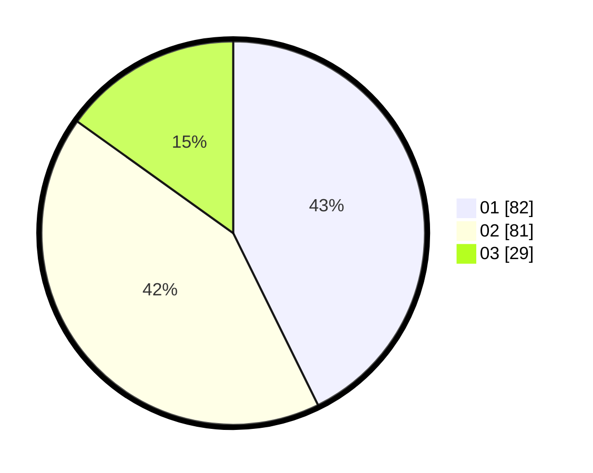

# Hasil

Hasil perolehan suara paslon dapat dilihat pada file paslon-01.txt, paslon-02.txt, dan paslon-03.txt.

Jika tidak ada, artinya data tersebut belum ada pada SIREKAP.

## Perolehan Suara

 * Paslon 01: **82**.
 * Paslon 02: **81**.
 * Paslon 03: **29**.

## Foto C Plano

https://sirekap-obj-formc.kpu.go.id/cd07/pemilu/ppwp/31/74/06/10/02/3174061002116-20240214-183008--8c71338d-a70b-402e-acc1-e3501a5b510b.jpg

https://sirekap-obj-formc.kpu.go.id/cd07/pemilu/ppwp/31/74/06/10/02/3174061002116-20240214-183030--ed2c97b9-532a-4334-8c46-e78c3c663eb9.jpg

https://sirekap-obj-formc.kpu.go.id/cd07/pemilu/ppwp/31/74/06/10/02/3174061002116-20240214-183019--cc9ddbe5-35d4-4388-8903-6d4fa40729dc.jpg

## DATA PEMILIH TETAP

Jumlah pemilih dalam DPT: **226**.
 * L: **115**.
 * P: **111**.

## DATA PENGGUNA HAK PILIH

Jumlah pengguna hak pilih dalam DPT: **197**.
 * L: **99**.
 * P: **98**.

Jumlah pengguna hak pilih dalam DPTb: **0**.
 * L: **0**.
 * P: **0**.

Jumlah pengguna hak pilih dalam DPK: **0**.
 * L: **0**.
 * P: **0**.

Jumlah pengguna hak pilih: **197**.
 * L: **99**.
 * P: **98**.

## JUMLAH SUARA SAH DAN TIDAK SAH

JUMLAH SELURUH SUARA SAH: **192**.

JUMLAH SUARA TIDAK SAH: **5**.

JUMLAH SELURUH SUARA SAH DAN SUARA TIDAK SAH: **197**.
