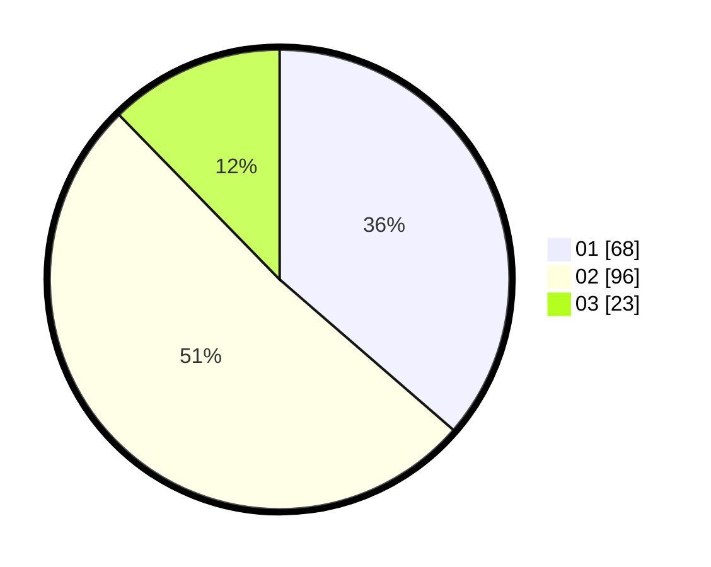

# Hasil

Hasil perolehan suara paslon dapat dilihat pada file paslon-01.txt, paslon-02.txt, dan paslon-03.txt.

Jika tidak ada, artinya data tersebut belum ada pada SIREKAP.

## Perolehan Suara

 * Paslon 01: **68**.
 * Paslon 02: **96**.
 * Paslon 03: **23**.

## Foto C Plano

https://sirekap-obj-formc.kpu.go.id/d61b/pemilu/ppwp/31/74/06/10/02/3174061002119-20240217-111939--44d7ba97-1b2f-4306-a3c0-fda1f1f9765e.jpg

https://sirekap-obj-formc.kpu.go.id/d61b/pemilu/ppwp/31/74/06/10/02/3174061002119-20240217-112041--f7b18400-a9f7-4c78-8a18-6e1ab083cf9d.jpg

https://sirekap-obj-formc.kpu.go.id/d61b/pemilu/ppwp/31/74/06/10/02/3174061002119-20240217-112142--93b3b8c1-db2f-4d3d-be06-9d80c0c83213.jpg

## DATA PEMILIH TETAP

Jumlah pemilih dalam DPT: **252**.
 * L: **114**.
 * P: **138**.

## DATA PENGGUNA HAK PILIH

Jumlah pengguna hak pilih dalam DPT: **187**.
 * L: **76**.
 * P: **111**.

Jumlah pengguna hak pilih dalam DPTb: **1**.
 * L: **1**.
 * P: **0**.

Jumlah pengguna hak pilih dalam DPK: **0**.
 * L: **0**.
 * P: **0**.

Jumlah pengguna hak pilih: **188**.
 * L: **77**.
 * P: **111**.

## JUMLAH SUARA SAH DAN TIDAK SAH

JUMLAH SELURUH SUARA SAH: **187**.

JUMLAH SUARA TIDAK SAH: **1**.

JUMLAH SELURUH SUARA SAH DAN SUARA TIDAK SAH: **188**.
