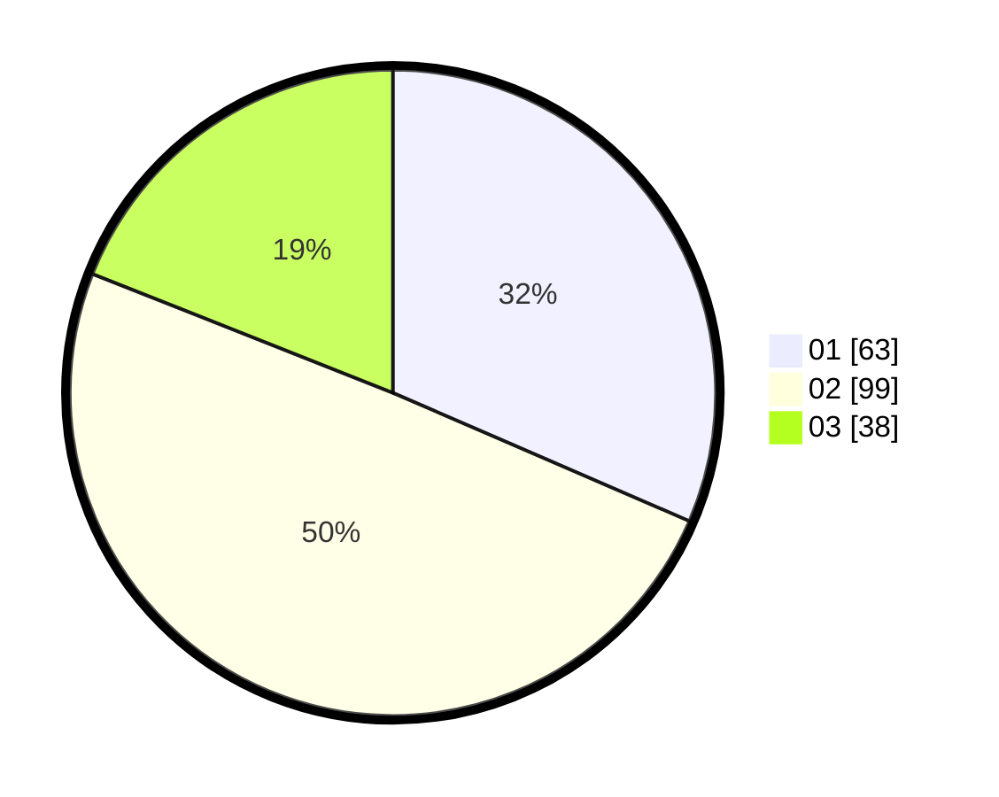

# Hasil

Hasil perolehan suara paslon dapat dilihat pada file paslon-01.txt, paslon-02.txt, dan paslon-03.txt.

Jika tidak ada, artinya data tersebut belum ada pada SIREKAP.

## Perolehan Suara

 * Paslon 01: **63**.
 * Paslon 02: **99**.
 * Paslon 03: **38**.

## Foto C Plano

https://sirekap-obj-formc.kpu.go.id/b675/pemilu/ppwp/31/74/06/10/02/3174061002120-20240217-111612--6ad957b1-bd1b-4381-ada1-942bb868aed7.jpg

https://sirekap-obj-formc.kpu.go.id/b675/pemilu/ppwp/31/74/06/10/02/3174061002120-20240217-111712--0611e386-f005-44d6-b5ef-f7b0e4eb0be2.jpg

https://sirekap-obj-formc.kpu.go.id/b675/pemilu/ppwp/31/74/06/10/02/3174061002120-20240217-111815--103f51c4-1ffd-4254-936b-ebeb0a71d287.jpg

## DATA PEMILIH TETAP

Jumlah pemilih dalam DPT: **202**.
 * L: **100**.
 * P: **102**.

## DATA PENGGUNA HAK PILIH

Jumlah pengguna hak pilih dalam DPT: **238**.
 * L: **115**.
 * P: **223**.

Jumlah pengguna hak pilih dalam DPTb: **0**.
 * L: **0**.
 * P: **0**.

Jumlah pengguna hak pilih dalam DPK: **0**.
 * L: **0**.
 * P: **0**.

Jumlah pengguna hak pilih: **238**.
 * L: **115**.
 * P: **123**.

## JUMLAH SUARA SAH DAN TIDAK SAH

JUMLAH SELURUH SUARA SAH: **200**.

JUMLAH SUARA TIDAK SAH: **2**.

JUMLAH SELURUH SUARA SAH DAN SUARA TIDAK SAH: **202**.
