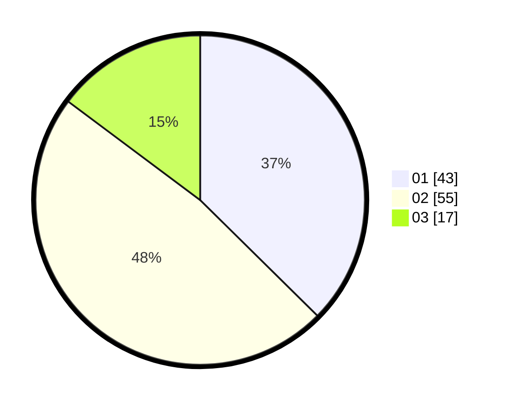

# Hasil

Hasil perolehan suara paslon dapat dilihat pada file paslon-01.txt, paslon-02.txt, dan paslon-03.txt.

Jika tidak ada, artinya data tersebut belum ada pada SIREKAP.

## Perolehan Suara

 * Paslon 01: **43**.
 * Paslon 02: **55**.
 * Paslon 03: **17**.

## Foto C Plano

https://sirekap-obj-formc.kpu.go.id/d1fb/pemilu/ppwp/31/74/06/10/02/3174061002122-20240218-140559--b6030a99-b222-4565-84c9-e5c0b133171c.jpg

https://sirekap-obj-formc.kpu.go.id/d1fb/pemilu/ppwp/31/74/06/10/02/3174061002122-20240218-140600--05a449c9-9351-4df0-94aa-ed77f1de7356.jpg

https://sirekap-obj-formc.kpu.go.id/d1fb/pemilu/ppwp/31/74/06/10/02/3174061002122-20240214-191606--dee92804-5bfc-4adb-925c-a809520bd4b9.jpg

## DATA PEMILIH TETAP

Jumlah pemilih dalam DPT: **148**.
 * L: **75**.
 * P: **73**.

## DATA PENGGUNA HAK PILIH

Jumlah pengguna hak pilih dalam DPT: **115**.
 * L: **56**.
 * P: **59**.

Jumlah pengguna hak pilih dalam DPTb: **0**.
 * L: **0**.
 * P: **0**.

Jumlah pengguna hak pilih dalam DPK: **0**.
 * L: **0**.
 * P: **0**.

Jumlah pengguna hak pilih: **115**.
 * L: **56**.
 * P: **59**.

## JUMLAH SUARA SAH DAN TIDAK SAH

JUMLAH SELURUH SUARA SAH: **115**.

JUMLAH SUARA TIDAK SAH: **0**.

JUMLAH SELURUH SUARA SAH DAN SUARA TIDAK SAH: **115**.
