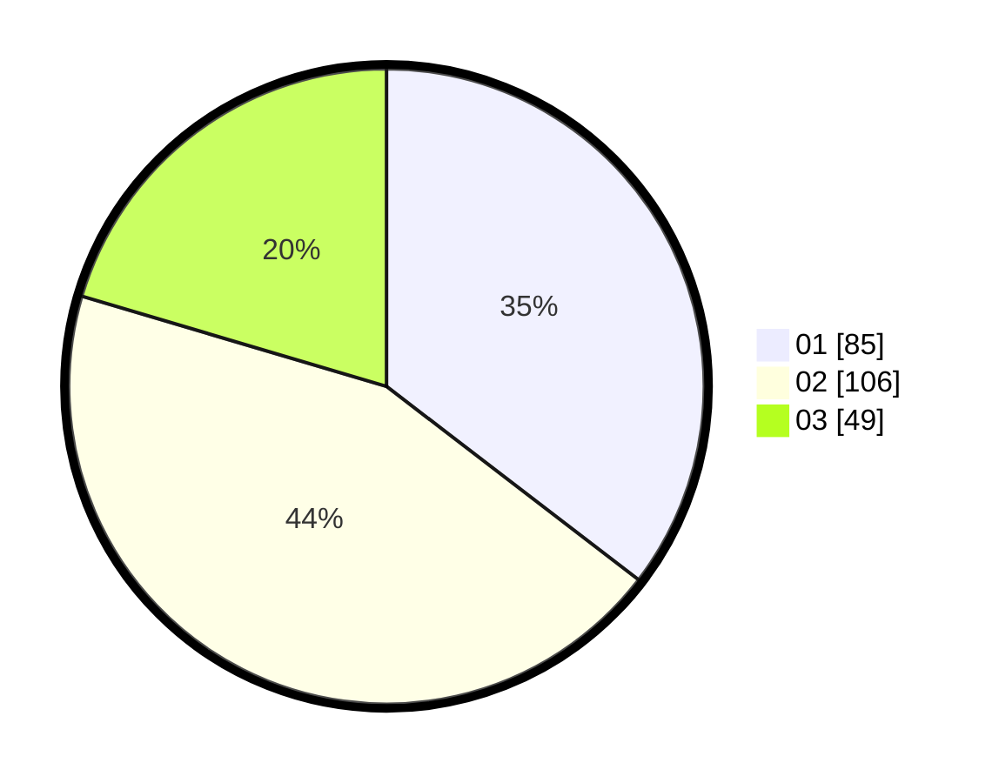

# Hasil

Hasil perolehan suara paslon dapat dilihat pada file paslon-01.txt, paslon-02.txt, dan paslon-03.txt.

Jika tidak ada, artinya data tersebut belum ada pada SIREKAP.

## Perolehan Suara

 * Paslon 01: **85**.
 * Paslon 02: **106**.
 * Paslon 03: **49**.

## Foto C Plano

https://sirekap-obj-formc.kpu.go.id/c44c/pemilu/ppwp/31/74/06/10/02/3174061002123-20240218-162120--e44dbd5f-57fa-4904-8a40-78c10f7b6792.jpg

https://sirekap-obj-formc.kpu.go.id/c44c/pemilu/ppwp/31/74/06/10/02/3174061002123-20240218-162224--c3dc2627-21a5-4327-bc72-f2e42ff1c6ff.jpg

https://sirekap-obj-formc.kpu.go.id/c44c/pemilu/ppwp/31/74/06/10/02/3174061002123-20240218-162316--3e9f411a-fab9-4ec9-ba20-2baad870f84e.jpg

## DATA PEMILIH TETAP

Jumlah pemilih dalam DPT: **278**.
 * L: **151**.
 * P: **127**.

## DATA PENGGUNA HAK PILIH

Jumlah pengguna hak pilih dalam DPT: **235**.
 * L: **123**.
 * P: **112**.

Jumlah pengguna hak pilih dalam DPTb: **5**.
 * L: **1**.
 * P: **9**.

Jumlah pengguna hak pilih dalam DPK: **5**.
 * L: **3**.
 * P: **2**.

Jumlah pengguna hak pilih: **245**.
 * L: **127**.
 * P: **718**.

## JUMLAH SUARA SAH DAN TIDAK SAH

JUMLAH SELURUH SUARA SAH: **240**.

JUMLAH SUARA TIDAK SAH: **5**.

JUMLAH SELURUH SUARA SAH DAN SUARA TIDAK SAH: **245**.
