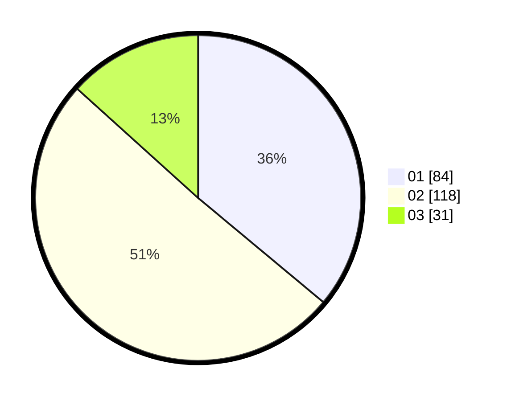

# Hasil

Hasil perolehan suara paslon dapat dilihat pada file paslon-01.txt, paslon-02.txt, dan paslon-03.txt.

Jika tidak ada, artinya data tersebut belum ada pada SIREKAP.

## Perolehan Suara

 * Paslon 01: **84**.
 * Paslon 02: **118**.
 * Paslon 03: **31**.

## Foto C Plano

https://sirekap-obj-formc.kpu.go.id/5722/pemilu/ppwp/31/74/06/10/02/3174061002124-20240214-205929--e7cea1e5-b470-4f99-8347-46512b76c597.jpg

https://sirekap-obj-formc.kpu.go.id/5722/pemilu/ppwp/31/74/06/10/02/3174061002124-20240214-210421--41556003-a2e5-45ce-88cf-9d4368934ee6.jpg

https://sirekap-obj-formc.kpu.go.id/5722/pemilu/ppwp/31/74/06/10/02/3174061002124-20240214-205759--8b43428a-f3d0-4613-bdb4-170dbad79357.jpg

## DATA PEMILIH TETAP

Jumlah pemilih dalam DPT: **285**.
 * L: **135**.
 * P: **150**.

## DATA PENGGUNA HAK PILIH

Jumlah pengguna hak pilih dalam DPT: **233**.
 * L: **106**.
 * P: **127**.

Jumlah pengguna hak pilih dalam DPTb: **1**.
 * L: **1**.
 * P: **0**.

Jumlah pengguna hak pilih dalam DPK: **2**.
 * L: **1**.
 * P: **1**.

Jumlah pengguna hak pilih: **236**.
 * L: **108**.
 * P: **128**.

## JUMLAH SUARA SAH DAN TIDAK SAH

JUMLAH SELURUH SUARA SAH: **233**.

JUMLAH SUARA TIDAK SAH: **3**.

JUMLAH SELURUH SUARA SAH DAN SUARA TIDAK SAH: **236**.
