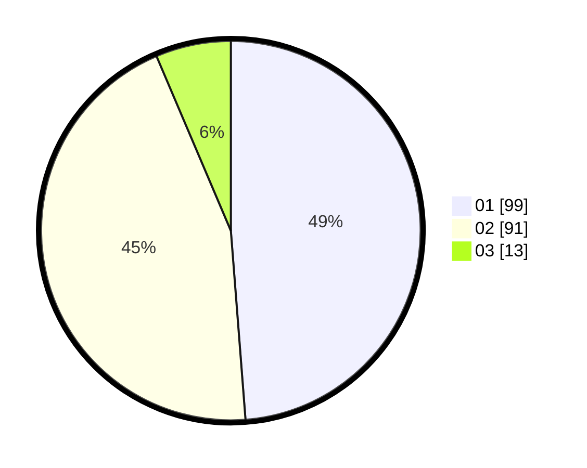

# Hasil

Hasil perolehan suara paslon dapat dilihat pada file paslon-01.txt, paslon-02.txt, dan paslon-03.txt.

Jika tidak ada, artinya data tersebut belum ada pada SIREKAP.

## Perolehan Suara

 * Paslon 01: **99**.
 * Paslon 02: **91**.
 * Paslon 03: **13**.

## Foto C Plano

https://sirekap-obj-formc.kpu.go.id/211d/pemilu/ppwp/31/74/06/10/02/3174061002126-20240215-223402--99be8d41-6f09-46c8-9874-713daeadc0c6.jpg

https://sirekap-obj-formc.kpu.go.id/211d/pemilu/ppwp/31/74/06/10/02/3174061002126-20240215-223404--603cde4e-2069-4f7c-ba98-d3bd5a7757fb.jpg

https://sirekap-obj-formc.kpu.go.id/211d/pemilu/ppwp/31/74/06/10/02/3174061002126-20240215-223403--0bff3c57-be4c-4fa3-891f-eb6012f5e202.jpg

## DATA PEMILIH TETAP

Jumlah pemilih dalam DPT: **225**.
 * L: **112**.
 * P: **113**.

## DATA PENGGUNA HAK PILIH

Jumlah pengguna hak pilih dalam DPT: **199**.
 * L: **99**.
 * P: **100**.

Jumlah pengguna hak pilih dalam DPTb: **5**.
 * L: **2**.
 * P: **3**.

Jumlah pengguna hak pilih dalam DPK: **0**.
 * L: **0**.
 * P: **0**.

Jumlah pengguna hak pilih: **204**.
 * L: **101**.
 * P: **103**.

## JUMLAH SUARA SAH DAN TIDAK SAH

JUMLAH SELURUH SUARA SAH: **203**.

JUMLAH SUARA TIDAK SAH: **1**.

JUMLAH SELURUH SUARA SAH DAN SUARA TIDAK SAH: **204**.
