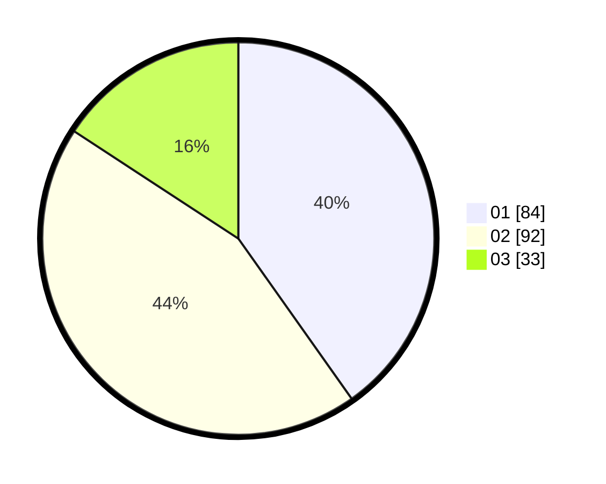

# Hasil

Hasil perolehan suara paslon dapat dilihat pada file paslon-01.txt, paslon-02.txt, dan paslon-03.txt.

Jika tidak ada, artinya data tersebut belum ada pada SIREKAP.

## Perolehan Suara

 * Paslon 01: **84**.
 * Paslon 02: **92**.
 * Paslon 03: **33**.

## Foto C Plano

https://sirekap-obj-formc.kpu.go.id/2d4d/pemilu/ppwp/31/74/06/10/02/3174061002127-20240215-225430--bafffc45-9675-4dce-a565-91d76191bf75.jpg

https://sirekap-obj-formc.kpu.go.id/2d4d/pemilu/ppwp/31/74/06/10/02/3174061002127-20240215-225431--07453f09-2708-4266-b418-a98fc835d20c.jpg

https://sirekap-obj-formc.kpu.go.id/2d4d/pemilu/ppwp/31/74/06/10/02/3174061002127-20240215-225431--387f1cf0-80d5-4fc4-ab28-759155410eb9.jpg

## DATA PEMILIH TETAP

Jumlah pemilih dalam DPT: **235**.
 * L: **116**.
 * P: **119**.

## DATA PENGGUNA HAK PILIH

Jumlah pengguna hak pilih dalam DPT: **202**.
 * L: **98**.
 * P: **104**.

Jumlah pengguna hak pilih dalam DPTb: **6**.
 * L: **2**.
 * P: **4**.

Jumlah pengguna hak pilih dalam DPK: **2**.
 * L: **0**.
 * P: **2**.

Jumlah pengguna hak pilih: **210**.
 * L: **100**.
 * P: **110**.

## JUMLAH SUARA SAH DAN TIDAK SAH

JUMLAH SELURUH SUARA SAH: **209**.

JUMLAH SUARA TIDAK SAH: **1**.

JUMLAH SELURUH SUARA SAH DAN SUARA TIDAK SAH: **210**.
