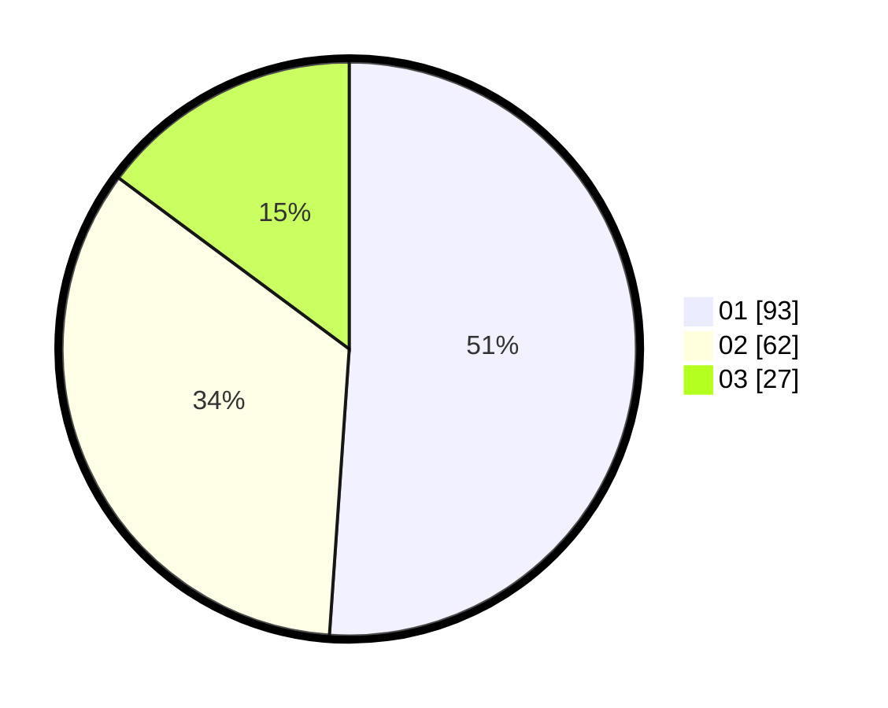

# Hasil

Hasil perolehan suara paslon dapat dilihat pada file paslon-01.txt, paslon-02.txt, dan paslon-03.txt.

Jika tidak ada, artinya data tersebut belum ada pada SIREKAP.

## Perolehan Suara

 * Paslon 01: **93**.
 * Paslon 02: **62**.
 * Paslon 03: **27**.

## Foto C Plano

https://sirekap-obj-formc.kpu.go.id/d738/pemilu/ppwp/31/74/06/10/02/3174061002128-20240214-210958--523bfc50-7c0f-4f8c-b03c-4126bef7957c.jpg

https://sirekap-obj-formc.kpu.go.id/d738/pemilu/ppwp/31/74/06/10/02/3174061002128-20240214-211403--b294f592-4c31-4344-9831-f082ad8168a7.jpg

https://sirekap-obj-formc.kpu.go.id/d738/pemilu/ppwp/31/74/06/10/02/3174061002128-20240214-211209--37092a76-80de-4534-a964-eb89852bdc05.jpg
