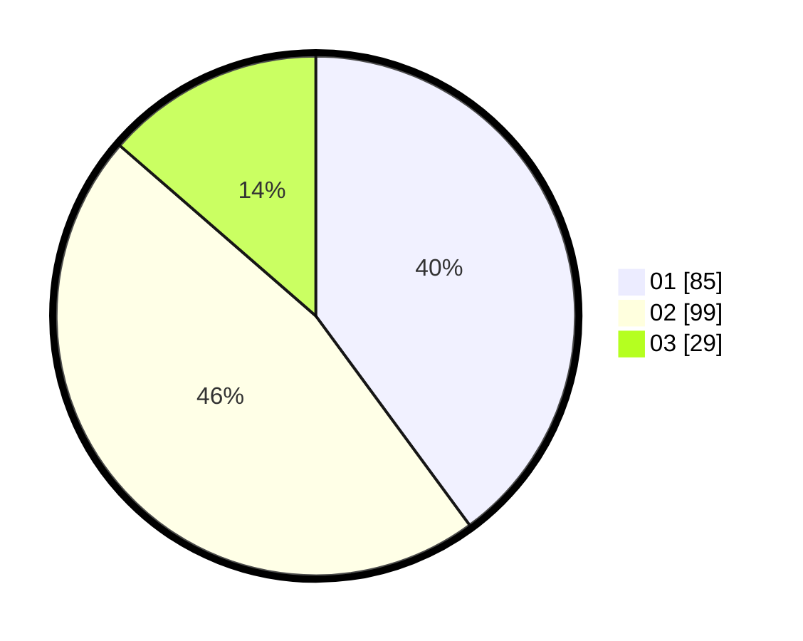

# Hasil

Hasil perolehan suara paslon dapat dilihat pada file paslon-01.txt, paslon-02.txt, dan paslon-03.txt.

Jika tidak ada, artinya data tersebut belum ada pada SIREKAP.

## Perolehan Suara

 * Paslon 01: **85**.
 * Paslon 02: **99**.
 * Paslon 03: **29**.

## Foto C Plano

https://sirekap-obj-formc.kpu.go.id/e0fb/pemilu/ppwp/31/74/06/10/03/3174061003009-20240216-112244--658295d3-4aec-4fc9-92e8-3803c50bf0d8.jpg

https://sirekap-obj-formc.kpu.go.id/e0fb/pemilu/ppwp/31/74/06/10/03/3174061003009-20240216-113346--439cd770-0c78-4b94-bbc6-45cae9575501.jpg

https://sirekap-obj-formc.kpu.go.id/e0fb/pemilu/ppwp/31/74/06/10/03/3174061003009-20240216-114002--6b1d7b4e-6b0a-4e9d-9f34-7ff8cb2641e7.jpg

## DATA PEMILIH TETAP

Jumlah pemilih dalam DPT: **272**.
 * L: **129**.
 * P: **143**.

## DATA PENGGUNA HAK PILIH

Jumlah pengguna hak pilih dalam DPT: **213**.
 * L: **100**.
 * P: **113**.

Jumlah pengguna hak pilih dalam DPTb: **1**.
 * L: **0**.
 * P: **1**.

Jumlah pengguna hak pilih dalam DPK: **0**.
 * L: **0**.
 * P: **0**.

Jumlah pengguna hak pilih: **214**.
 * L: **100**.
 * P: **114**.

## JUMLAH SUARA SAH DAN TIDAK SAH

JUMLAH SELURUH SUARA SAH: **213**.

JUMLAH SUARA TIDAK SAH: **1**.

JUMLAH SELURUH SUARA SAH DAN SUARA TIDAK SAH: **214**.
