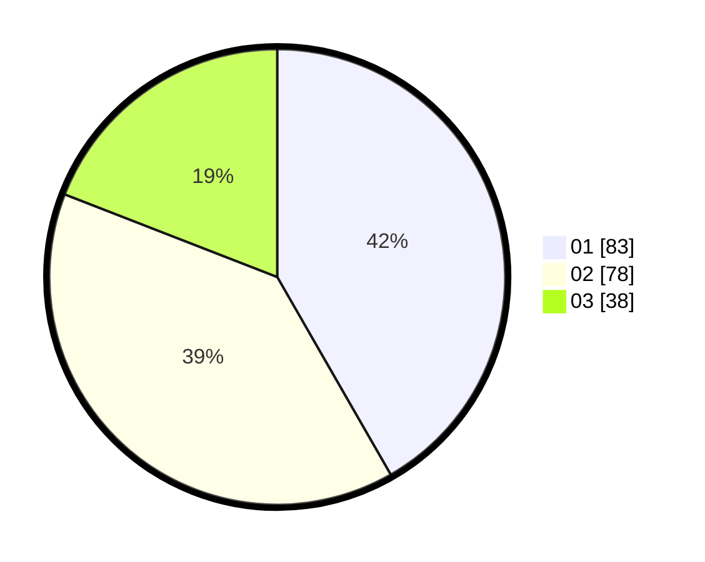

# Hasil

Hasil perolehan suara paslon dapat dilihat pada file paslon-01.txt, paslon-02.txt, dan paslon-03.txt.

Jika tidak ada, artinya data tersebut belum ada pada SIREKAP.

## Perolehan Suara

 * Paslon 01: **83**.
 * Paslon 02: **78**.
 * Paslon 03: **38**.

## Foto C Plano

https://sirekap-obj-formc.kpu.go.id/112b/pemilu/ppwp/31/74/06/10/03/3174061003019-20240216-084907--6cd0e107-1e24-4cf8-8b61-e20773c4e045.jpg

https://sirekap-obj-formc.kpu.go.id/112b/pemilu/ppwp/31/74/06/10/03/3174061003019-20240216-091204--07717d28-2d9d-417d-a6c9-7c334affde23.jpg

https://sirekap-obj-formc.kpu.go.id/112b/pemilu/ppwp/31/74/06/10/03/3174061003019-20240216-091202--4e0ac013-f884-4ce1-8bcf-80dec61f0e15.jpg

## DATA PEMILIH TETAP

Jumlah pemilih dalam DPT: **0**.
 * L: **0**.
 * P: **0**.

## DATA PENGGUNA HAK PILIH

Jumlah pengguna hak pilih dalam DPT: **0**.
 * L: **0**.
 * P: **0**.

Jumlah pengguna hak pilih dalam DPTb: **0**.
 * L: **0**.
 * P: **0**.

Jumlah pengguna hak pilih dalam DPK: **0**.
 * L: **0**.
 * P: **0**.

Jumlah pengguna hak pilih: **0**.
 * L: **0**.
 * P: **0**.

## JUMLAH SUARA SAH DAN TIDAK SAH

JUMLAH SELURUH SUARA SAH: **199**.

JUMLAH SUARA TIDAK SAH: **4**.

JUMLAH SELURUH SUARA SAH DAN SUARA TIDAK SAH: **203**.
