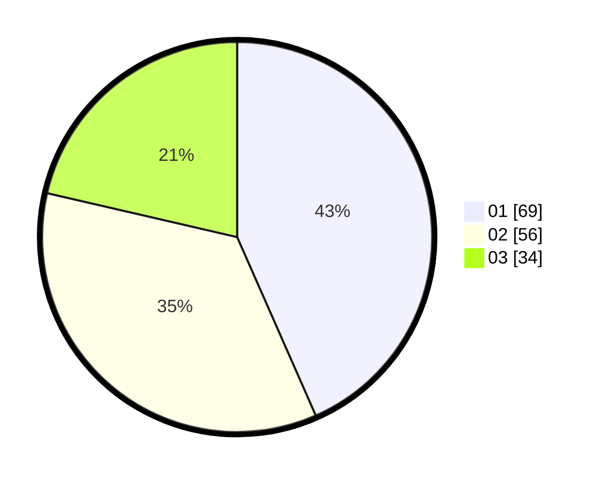

# Hasil

Hasil perolehan suara paslon dapat dilihat pada file paslon-01.txt, paslon-02.txt, dan paslon-03.txt.

Jika tidak ada, artinya data tersebut belum ada pada SIREKAP.

## Perolehan Suara

 * Paslon 01: **69**.
 * Paslon 02: **56**.
 * Paslon 03: **34**.

## Foto C Plano

https://sirekap-obj-formc.kpu.go.id/fdd2/pemilu/ppwp/31/74/06/10/03/3174061003024-20240215-151545--ad2e4eca-3573-4731-afe2-3349b641befd.jpg

https://sirekap-obj-formc.kpu.go.id/fdd2/pemilu/ppwp/31/74/06/10/03/3174061003024-20240215-153726--2ad5f825-4bce-45a4-882a-dae4dec58813.jpg

https://sirekap-obj-formc.kpu.go.id/fdd2/pemilu/ppwp/31/74/06/10/03/3174061003024-20240215-153732--a30aef9d-eec2-4977-a2f4-759b80a57285.jpg

## DATA PEMILIH TETAP

Jumlah pemilih dalam DPT: **219**.
 * L: **109**.
 * P: **110**.

## DATA PENGGUNA HAK PILIH

Jumlah pengguna hak pilih dalam DPT: **161**.
 * L: **77**.
 * P: **84**.

Jumlah pengguna hak pilih dalam DPTb: **0**.
 * L: **0**.
 * P: **0**.

Jumlah pengguna hak pilih dalam DPK: **0**.
 * L: **0**.
 * P: **0**.

Jumlah pengguna hak pilih: **161**.
 * L: **77**.
 * P: **84**.

## JUMLAH SUARA SAH DAN TIDAK SAH

JUMLAH SELURUH SUARA SAH: **159**.

JUMLAH SUARA TIDAK SAH: **2**.

JUMLAH SELURUH SUARA SAH DAN SUARA TIDAK SAH: **161**.
