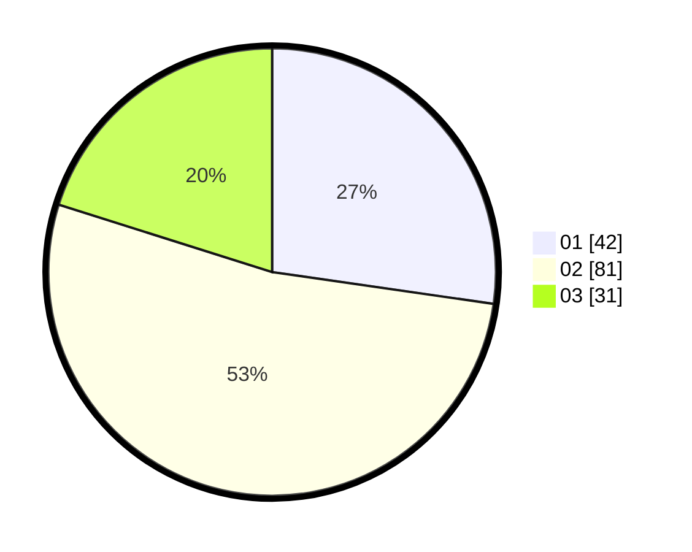

# Hasil

Hasil perolehan suara paslon dapat dilihat pada file paslon-01.txt, paslon-02.txt, dan paslon-03.txt.

Jika tidak ada, artinya data tersebut belum ada pada SIREKAP.

## Perolehan Suara

 * Paslon 01: **42**.
 * Paslon 02: **81**.
 * Paslon 03: **31**.

## Foto C Plano

https://sirekap-obj-formc.kpu.go.id/2957/pemilu/ppwp/31/74/06/10/03/3174061003025-20240214-215914--9c0c527b-8db6-490d-835e-c805a54bde32.jpg

https://sirekap-obj-formc.kpu.go.id/2957/pemilu/ppwp/31/74/06/10/03/3174061003025-20240214-220614--41492c3c-3a6e-49df-a054-5e22ad774fdc.jpg

https://sirekap-obj-formc.kpu.go.id/2957/pemilu/ppwp/31/74/06/10/03/3174061003025-20240214-221003--8d3e8a83-c501-436a-bf06-51309d168ff4.jpg

## DATA PEMILIH TETAP

Jumlah pemilih dalam DPT: **216**.
 * L: **107**.
 * P: **109**.

## DATA PENGGUNA HAK PILIH

Jumlah pengguna hak pilih dalam DPT: **155**.
 * L: **75**.
 * P: **81**.

Jumlah pengguna hak pilih dalam DPTb: **210**.
 * L: **20**.
 * P: **410**.

Jumlah pengguna hak pilih dalam DPK: **1**.
 * L: **0**.
 * P: **1**.

Jumlah pengguna hak pilih: **159**.
 * L: **75**.
 * P: **83**.

## JUMLAH SUARA SAH DAN TIDAK SAH

JUMLAH SELURUH SUARA SAH: **154**.

JUMLAH SUARA TIDAK SAH: **5**.

JUMLAH SELURUH SUARA SAH DAN SUARA TIDAK SAH: **159**.
