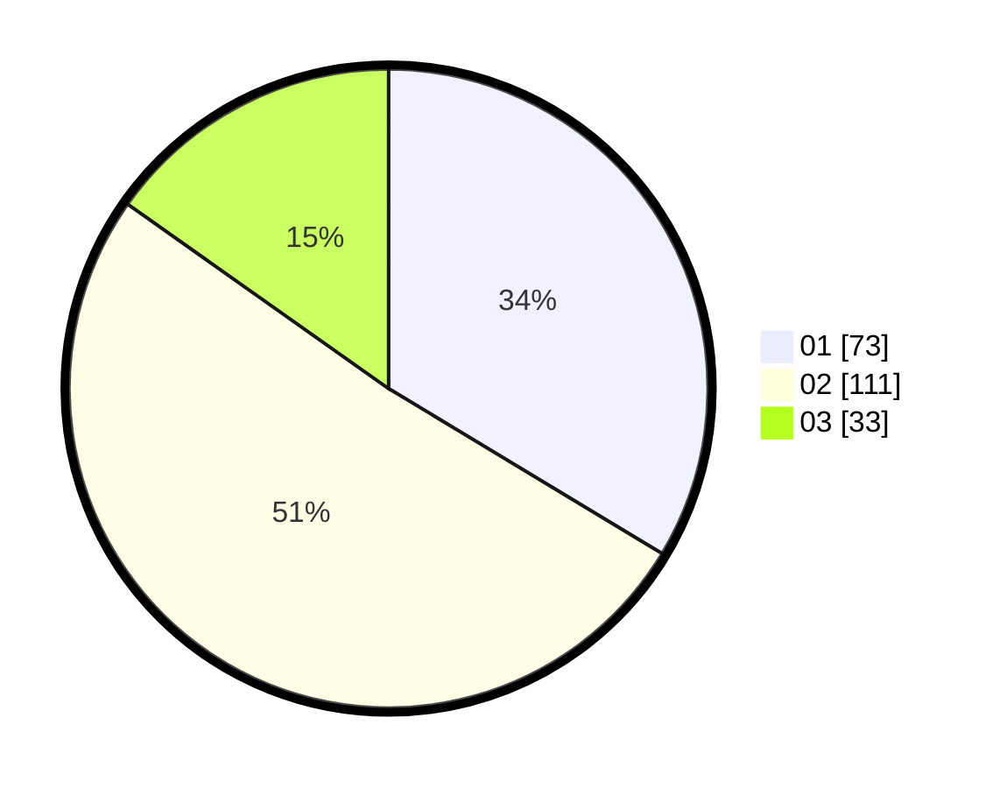

# Hasil

Hasil perolehan suara paslon dapat dilihat pada file paslon-01.txt, paslon-02.txt, dan paslon-03.txt.

Jika tidak ada, artinya data tersebut belum ada pada SIREKAP.

## Perolehan Suara

 * Paslon 01: **73**.
 * Paslon 02: **111**.
 * Paslon 03: **33**.

## Foto C Plano

https://sirekap-obj-formc.kpu.go.id/5c73/pemilu/ppwp/31/74/06/10/03/3174061003033-20240214-155638--1d67fc7b-e5b5-42da-9a41-5c9b599d1334.jpg

https://sirekap-obj-formc.kpu.go.id/5c73/pemilu/ppwp/31/74/06/10/03/3174061003033-20240214-155916--66cc27f6-871f-4cd2-be13-436ea676b076.jpg

https://sirekap-obj-formc.kpu.go.id/5c73/pemilu/ppwp/31/74/06/10/03/3174061003033-20240214-155319--da5dc51f-4001-40c5-b966-5d99ff82b090.jpg

## DATA PEMILIH TETAP

Jumlah pemilih dalam DPT: **278**.
 * L: **132**.
 * P: **146**.

## DATA PENGGUNA HAK PILIH

Jumlah pengguna hak pilih dalam DPT: **222**.
 * L: **105**.
 * P: **117**.

Jumlah pengguna hak pilih dalam DPTb: **0**.
 * L: **0**.
 * P: **0**.

Jumlah pengguna hak pilih dalam DPK: **1**.
 * L: **1**.
 * P: **0**.

Jumlah pengguna hak pilih: **223**.
 * L: **106**.
 * P: **117**.

## JUMLAH SUARA SAH DAN TIDAK SAH

JUMLAH SELURUH SUARA SAH: **217**.

JUMLAH SUARA TIDAK SAH: **6**.

JUMLAH SELURUH SUARA SAH DAN SUARA TIDAK SAH: **223**.
