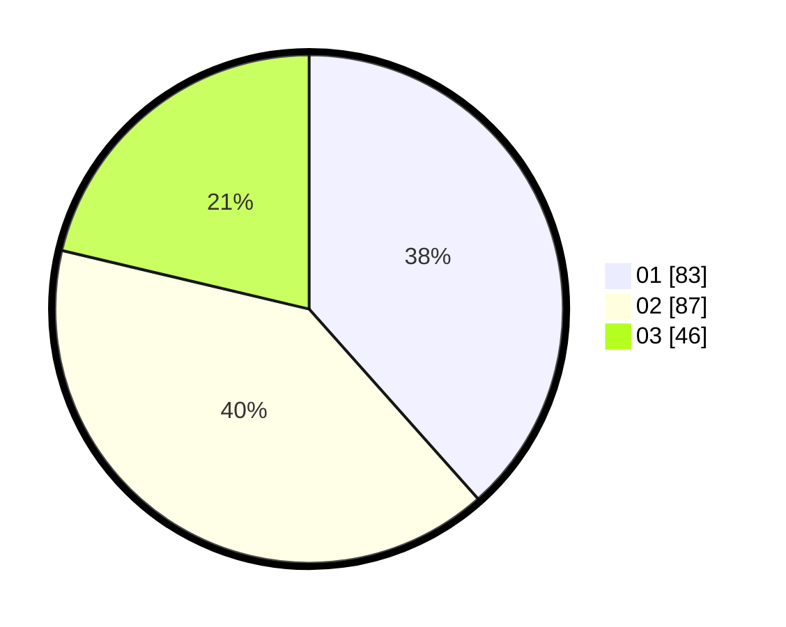

# Hasil

Hasil perolehan suara paslon dapat dilihat pada file paslon-01.txt, paslon-02.txt, dan paslon-03.txt.

Jika tidak ada, artinya data tersebut belum ada pada SIREKAP.

## Perolehan Suara

 * Paslon 01: **83**.
 * Paslon 02: **87**.
 * Paslon 03: **46**.

## Foto C Plano

https://sirekap-obj-formc.kpu.go.id/2722/pemilu/ppwp/31/74/06/10/03/3174061003043-20240214-205552--b0937211-09ce-4141-a017-e8e032f46ea9.jpg

https://sirekap-obj-formc.kpu.go.id/2722/pemilu/ppwp/31/74/06/10/03/3174061003043-20240214-205907--87381374-262a-44a6-a087-6f4ae317a00f.jpg

https://sirekap-obj-formc.kpu.go.id/2722/pemilu/ppwp/31/74/06/10/03/3174061003043-20240214-210019--40122974-efc9-4cc3-933f-43e73be724ce.jpg

## DATA PEMILIH TETAP

Jumlah pemilih dalam DPT: **262**.
 * L: **130**.
 * P: **132**.

## DATA PENGGUNA HAK PILIH

Jumlah pengguna hak pilih dalam DPT: **213**.
 * L: **105**.
 * P: **108**.

Jumlah pengguna hak pilih dalam DPTb: **3**.
 * L: **1**.
 * P: **2**.

Jumlah pengguna hak pilih dalam DPK: **2**.
 * L: **2**.
 * P: **0**.

Jumlah pengguna hak pilih: **218**.
 * L: **108**.
 * P: **110**.

## JUMLAH SUARA SAH DAN TIDAK SAH

JUMLAH SELURUH SUARA SAH: **216**.

JUMLAH SUARA TIDAK SAH: **2**.

JUMLAH SELURUH SUARA SAH DAN SUARA TIDAK SAH: **218**.
